 is
replaced by scripts/guide/build-guide.mjs with a table derived from SITE_INVENTORY.json or
GUIDE_VERIFICATION_MAP.json, so no factual table in this document is maintained by hand.

A figure is written as:  followed by a caption paragraph
beginning with "شکل". The builder numbers figures automatically.
-->

# راهنمای جامع استفاده، مدیریت و پیکربندی اکوسیستم Dragon

## راهنمای کاربران، برگزارکنندگان، مدرسان، اپراتورها و مدیران فنی

> این راهنما بر اساس قابلیت‌های واقعی نسخه ثبت‌شده تهیه شده است.
> قابلیت‌های وابسته به تصمیم‌های باز، مجوزهای خاص یا ارائه‌دهندگان خارجی
> به‌صورت محدود، غیرفعال، آزمایشی یا مسدود مشخص شده‌اند.

---

## نشانه‌گذاری این سند

| نشانه | معنی |
|---|---|
| **کاربر** | دستورالعمل کاربر عمومی |
| **اپراتور** | دستورالعمل دارنده نقش عملیاتی |
| **مدیر** | دستورالعمل مدیر پلتفرم |
| **فنی** | پیکربندی فنی و استقرار |
| **حساس** | نکته امنیتی؛ اجرای آن دسترسی یا داده را تغییر می‌دهد |

هر جا قابلیتی در دسترس نیست، یکی از این برچسب‌ها آمده است: «نیازمند مجوز»،
«بسته با Feature Gate»، «ارائه‌دهنده در دسترس نیست»، «مسدود با تصمیم باز»، «پیاده‌سازی نشده».

---

# فصل ۱ — معرفی راهنما و وضعیت نسخه

## ۱.۱ این راهنما چه چیزی را پوشش می‌دهد

اکوسیستم Dragon یک پلتفرم ورزش‌های الکترونیک است با تورنمنت، تیم، آکادمی آموزشی، پخش زنده،
جامعه کاربری، فروشگاه و اقتصاد داخلی. این راهنما همه سطوح استفاده را پوشش می‌دهد: بازدیدکننده،
کاربر ثبت‌نام‌شده، شرکت‌کننده، مدیر تیم، مدرس، اپراتور پخش، ناظر، اپراتور فروشگاه، اپراتور
مالی، پشتیبانی، مدیر و اپراتور فنی.

## ۱.۲ آنچه این راهنما ادعا نمی‌کند

این نسخه یک نسخه در حال توسعه است. تصمیم انتشار اکوسیستم در مخزن **NO-GO** ثبت شده است.
بنابراین:

- هیچ ادعایی درباره آمادگی تولید، پایداری، یا سطح سرویس در این سند نیست؛
- هیچ گواهی دسترس‌پذیری انسانی و هیچ آزمون نفوذ انجام نشده است؛
- هیچ وعده زمان پاسخ، بازپرداخت یا در دسترس بودن داده نشده است.

## ۱.۳ خلاصه شمارشی نسخه

| مورد | تعداد |
|---|---|
| نقطه پایانی API | 291 |
| مسیر عمومی (بدون ورود) | 43 |
| مسیر نیازمند ورود | 85 |
| مسیر نیازمند مجوز | 163 |
| مسیر رابط کاربری | 63 |
| ناحیه مدیریتی | 20 |
| نقش | 16 |
| مجوز | 22 |
| Feature Gate | 10 |
| متغیر محیطی | 39 |
| تصویر ثبت‌شده | 153 |

## ۱.۴ دو مشکل پرتکرار — پاسخ کوتاه

اگر برای همین دو مورد به این سند مراجعه کرده‌اید:

- **«نمی‌توانم دوره بسازم»** → فصل ۱۰. علت تقریباً همیشه نداشتن مجوز `education.manage` است،
  و پس از آن، ناآشنایی با چرخه `draft ← review ← published`.
- **«نمی‌توانم پخش زنده بسازم»** → فصل ۱۲. علت نداشتن مجوز `stream.manage` است. توجه کنید که
  حتی با مجوز، ارائه‌دهنده پخش در این نسخه **شبیه‌سازی‌شده** است و پخش واقعی وجود ندارد.

---

# فصل ۲ — اجرای محلی و ورود به سامانه

## ۲.۱ پیش‌نیازها **فنی**

- Node.js نسخه ۲۲٫۱۸ یا بالاتر (اجرای مستقیم TypeScript بدون پرچم آزمایشی)؛
- Docker برای MongoDB با Replica Set؛
- سیستم‌عامل: توسعه روی ویندوز پشتیبانی می‌شود.

## ۲.۲ راه‌اندازی

```bash
npm install
npm run docker:up
npm run migrate
```

فایل محیط را از روی نمونه بسازید. **هرگز مقدار محرمانه واقعی را در مخزن قرار ندهید.**
برای ساخت فایل محلی، اسکریپت `06-CREATE-LOCAL-ENV.cmd` را اجرا کنید.

## ۲.۳ ورود

ورود با شماره موبایل و رمز یک‌بارمصرف انجام می‌شود. رمز عبور ثابتی وجود ندارد.


شکل — ورود با شماره موبایل و رمز یک‌بارمصرف.

**مراحل** **کاربر**

۱. به `/{locale}/auth/mobile` بروید (مثلاً `/fa/auth/mobile`).
۲. شماره موبایل خود را وارد کنید و «دریافت کد» را بزنید.
۳. کد پیامک‌شده را وارد کنید و تأیید کنید.
۴. در نخستین ورود، تکمیل پروفایل خواسته می‌شود.

**نتیجه مورد انتظار:** انتقال به `/{locale}/account` یا `/{locale}/account/profile`.

**خطاهای رایج**

| نشانه | علت | راه‌حل |
|---|---|---|
| کد نمی‌رسد | در توسعه، پیامک واقعی ارسال نمی‌شود | صندوق توسعه: `/api/v1/dev/sms-inbox?mobile=…` (فقط محیط توسعه) |
| «تعداد درخواست زیاد است» | سقف `OTP_REQUESTS_PER_MOBILE` یا `OTP_REQUESTS_PER_IP` | تا پایان پنجره `OTP_WINDOW_SECONDS` صبر کنید |
| کد منقضی شده | `OTP_TTL_SECONDS` (پیش‌فرض ۱۲۰ ثانیه) | کد جدید بگیرید |

## ۲.۴ زبان و جهت متن

سامانه دوزبانه است: فارسی (راست‌به‌چپ، پیش‌فرض) و انگلیسی (چپ‌به‌راست). زبان در نشانی صفحه
قرار دارد: `/fa/...` و `/en/...`. تغییر زبان از نوار بالای صفحه انجام می‌شود و جهت صفحه
به‌صورت خودکار تغییر می‌کند.

---

# فصل ۳ — نقشه کامل سایت

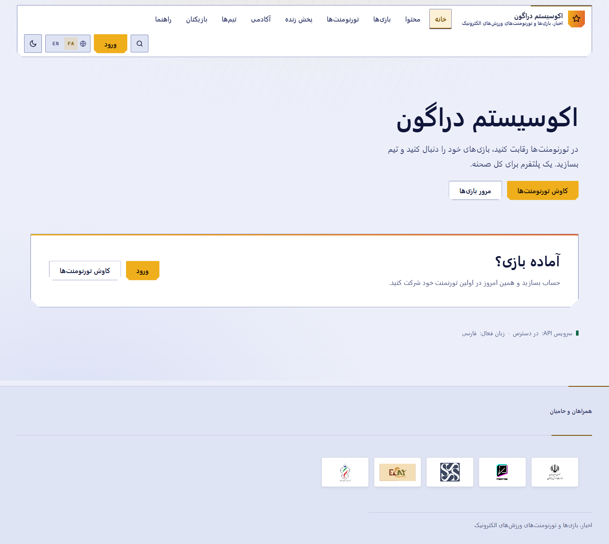

شکل — صفحه نخست اکوسیستم دراگون.

## ۳.۱ بخش عمومی

| مسیر | نما |
|---|---|
| `/:locale(fa\|en)` | `HomeView.vue` |
| `/:locale(fa\|en)/design-system` | `DesignSystemView.vue` |
| `/:locale(fa\|en)/content` | `ContentListView.vue` |
| `/:locale(fa\|en)/content/:type/:slug` | `ContentDetailView.vue` |
| `/:locale(fa\|en)/games` | `GamesCatalogView.vue` |
| `/:locale(fa\|en)/games/:slug` | `GameDetailView.vue` |
| `/:locale(fa\|en)/tournaments` | `TournamentsListView.vue` |
| `/:locale(fa\|en)/tournaments-calendar` | `TournamentCalendarView.vue` |
| `/:locale(fa\|en)/tournaments/:slug` | `TournamentDetailView.vue` |
| `/:locale(fa\|en)/teams` | `TeamsDirectoryView.vue` |
| `/:locale(fa\|en)/teams/:slug` | `PublicTeamView.vue` |
| `/:locale(fa\|en)/players` | `PlayersDirectoryView.vue` |
| `/:locale(fa\|en)/streams` | `StreamsListView.vue` |
| `/:locale(fa\|en)/streams/:slug` | `StreamDetailView.vue` |
| `/:locale(fa\|en)/academy` | `AcademyCatalogView.vue` |
| `/:locale(fa\|en)/academy/courses/:slug` | `CourseDetailView.vue` |
| `/:locale(fa\|en)/store` | `StoreCatalogView.vue` |
| `/:locale(fa\|en)/store/products/:slug` | `StoreProductView.vue` |
| `/:locale(fa\|en)/community` | `CommunityFeedView.vue` |
| `/:locale(fa\|en)/community/posts/:id` | `CommunityPostView.vue` |
| `/:locale(fa\|en)/search` | `SearchView.vue` |
| `/:locale(fa\|en)/help` | `HelpView.vue` |
| `/:locale(fa\|en)/players/:username` | `PublicPlayerView.vue` |
| `/:locale(fa\|en)/auth/mobile` | `AuthMobileView.vue` |
| `/:locale(fa\|en)/403` | `ForbiddenView.vue` |
| `/:pathMatch(.*)*` | `NotFoundView.vue` |

## ۳.۲ بخش حساب کاربری

| مسیر | نما |
|---|---|
| `/:locale(fa\|en)/academy/learn/:enrollmentId` | `CoursePlayerView.vue` |
| `/:locale(fa\|en)/cart` | `CartView.vue` |
| `/:locale(fa\|en)/checkout` | `CheckoutView.vue` |
| `/:locale(fa\|en)/account/orders` | `AccountOrdersView.vue` |
| `/:locale(fa\|en)/account/registrations` | `AccountRegistrationsView.vue` |
| `/:locale(fa\|en)/account/matches` | `AccountMatchesView.vue` |
| `/:locale(fa\|en)/account` | `AccountOverviewView.vue` |
| `/:locale(fa\|en)/account/profile` | `AccountProfileView.vue` |
| `/:locale(fa\|en)/account/security` | `AccountSecurityView.vue` |
| `/:locale(fa\|en)/account/wallet` | `AccountWalletView.vue` |
| `/:locale(fa\|en)/account/notifications` | `NotificationsInboxView.vue` |
| `/:locale(fa\|en)/account/teams` | `TeamsView.vue` |
| `/:locale(fa\|en)/account/teams/:id` | `TeamDetailView.vue` |
| `/:locale(fa\|en)/account/gaming-identities` | `GamingIdentitiesView.vue` |

## ۳.۳ بخش مدیریت

| مسیر | نما |
|---|---|
| `/:locale(fa\|en)/admin` | `AdminOverviewView.vue` |
| `/:locale(fa\|en)/admin/users` | `AdminUsersView.vue` |
| `/:locale(fa\|en)/admin/audit` | `AdminAuditView.vue` |
| `/:locale(fa\|en)/admin/moderation` | `AdminModerationView.vue` |
| `/:locale(fa\|en)/admin/courses` | `AdminCoursesView.vue` |
| `/:locale(fa\|en)/admin/chat` | `AdminChatView.vue` |
| `/:locale(fa\|en)/admin/streams` | `AdminStreamsView.vue` |
| `/:locale(fa\|en)/admin/prizes` | `AdminPrizesView.vue` |
| `/:locale(fa\|en)/admin/store` | `AdminStoreView.vue` |
| `/:locale(fa\|en)/admin/orders` | `AdminOrdersView.vue` |
| `/:locale(fa\|en)/admin/community` | `AdminCommunityView.vue` |
| `/:locale(fa\|en)/admin/media` | `AdminMediaView.vue` |
| `/:locale(fa\|en)/admin/configuration` | `AdminConfigurationView.vue` |
| `/:locale(fa\|en)/admin/notifications` | `AdminNotificationsView.vue` |
| `/:locale(fa\|en)/admin/organizer` | `OrganizerWorkspaceView.vue` |
| `/:locale(fa\|en)/admin/finance` | `AdminFinanceView.vue` |
| `/:locale(fa\|en)/admin/support` | `AdminSupportView.vue` |
| `/:locale(fa\|en)/admin/operations` | `AdminOperationsView.vue` |
| `/:locale(fa\|en)/admin/content` | `AdminContentView.vue` |
| `/:locale(fa\|en)/admin/games` | `AdminGamesView.vue` |
| `/:locale(fa\|en)/admin/tournaments` | `AdminTournamentsView.vue` |
| `/:locale(fa\|en)/admin/tournaments/:id/registrations` | `AdminTournamentRegistrationsView.vue` |
| `/:locale(fa\|en)/admin/tournaments/:id/competition` | `AdminTournamentCompetitionView.vue` |

## ۳.۴ نمایش موبایل

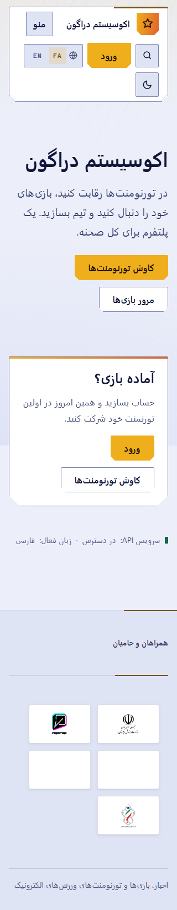

شکل — همان صفحه در عرض ۳۲۰ پیکسل؛ ناوبری اصلی در منوی جمع‌شونده قرار می‌گیرد.

---

# فصل ۴ — نقش‌ها، دسترسی‌ها و Feature Gateها

این فصل مهم‌ترین فصل برای رفع اشکال است. بیشتر پرسش‌های «این گزینه کجاست؟» ریشه در همین
مفاهیم دارند.

## ۴.۱ سه مفهوم متفاوت که اشتباه گرفته می‌شوند

| مفهوم | معنی | مثال |
|---|---|---|
| **نقش** | برچسبی که به حساب داده می‌شود | `education_manager` |
| **مجوز** | اجازه انجام یک کار که نقش آن را حمل می‌کند | `education.manage` |
| **Feature Gate** | کلید پیکربندی که یک قابلیت را برای **همه** می‌بندد | `PAID_COURSES_ENABLED` |

نداشتن مجوز یعنی «شما اجازه ندارید». بسته‌بودن Feature Gate یعنی «این قابلیت برای هیچ‌کس
فعال نیست». این دو راه‌حل کاملاً متفاوتی دارند.

## ۴.۲ ماتریس نقش و مجوز

| نقش | کد | مجوزها |
|---|---|---|
| مدیر ارشد سامانه | `super_administrator` | **همه مجوزها** (نقش کنترل‌شده اضطراری) |
| مدیر پلتفرم | `platform_administrator` | `admin.access`، `users.read`، `users.suspend`، `roles.read`، `roles.assign`، `config.read`، `config.propose`، `audit.read` |
| اپراتور مالی | `finance_operator` | `admin.access`، `finance.manage`، `config.propose`، `audit.read` |
| تأییدکننده مالی | `financial_approver` | `admin.access`، `finance.approve`، `config.approve`، `audit.read` |
| نویسنده محتوا | `content_author` | `admin.access`، `content.write` |
| ویراستار محتوا | `content_editor` | `admin.access`، `content.write` |
| منتشرکننده محتوا | `content_publisher` | `admin.access`، `content.write`، `content.publish`، `games.manage` |
| اپراتور پخش زنده | `streaming_operator` | `admin.access`، `stream.manage` |
| مدیر تورنمنت | `tournament_administrator` | `admin.access`، `tournament.manage` |
| برگزارکننده تورنمنت | `tournament_organizer` | `admin.access`، `tournament.manage` |
| مدیر آموزش | `education_manager` | `admin.access`، `education.manage` |
| ناظر گفت‌وگوی زنده | `live_chat_moderator` | `admin.access`، `chat.moderate` |
| ناظر جامعه | `community_moderator` | `admin.access`، `moderation.manage`، `chat.moderate` |
| اپراتور فروشگاه | `shop_operator` | `admin.access`، `store.manage` |
| اپراتور پشتیبانی | `support_operator` | `admin.access`، `support.manage`، `users.read` |
| ممیز امنیتی | `security_auditor` | `admin.access`، `audit.read`، `audit.export` |

## ۴.۳ مجوز لازم برای هر ناحیه مدیریتی

| ناحیه | مسیر | مجوز لازم |
|---|---|---|
| `area-content` | `/admin/content` | `content.write` |
| `area-games` | `/admin/games` | `games.manage` |
| `area-organizer` | `/admin/organizer` | `tournament.manage` |
| `area-tournaments` | `/admin/tournaments` | `tournament.manage` |
| `area-streams` | `/admin/streams` | `stream.manage` |
| `area-chat` | `/admin/chat` | `chat.moderate` |
| `area-prizes` | `/admin/prizes` | `finance.manage` |
| `area-store` | `/admin/store` | `store.manage` |
| `area-orders` | `/admin/orders` | `store.manage` |
| `area-community` | `/admin/community` | `moderation.manage` |
| `area-courses` | `/admin/courses` | `education.manage` |
| `area-users` | `/admin/users` | `users.read` |
| `area-audit` | `/admin/audit` | `audit.read` |
| `area-moderation` | `/admin/moderation` | `moderation.manage` |
| `area-media` | `/admin/media` | `content.publish` |
| `area-configuration` | `/admin/configuration` | `config.read` |
| `area-notifications` | `/admin/notifications` | `support.manage` |
| `area-finance` | `/admin/finance` | `finance.manage` |
| `area-support` | `/admin/support` | `support.manage` |
| `area-operations` | `/admin/operations` | `support.manage` |

## ۴.۴ چرا یک گزینه دیده نمی‌شود

کارت‌های ناحیه مدیریتی از روی **مجوزهای مؤثر کاربر که سرور اعلام می‌کند** ساخته می‌شوند. اگر
کارتی دیده نمی‌شود، معمولاً یعنی مجوز آن را ندارید.

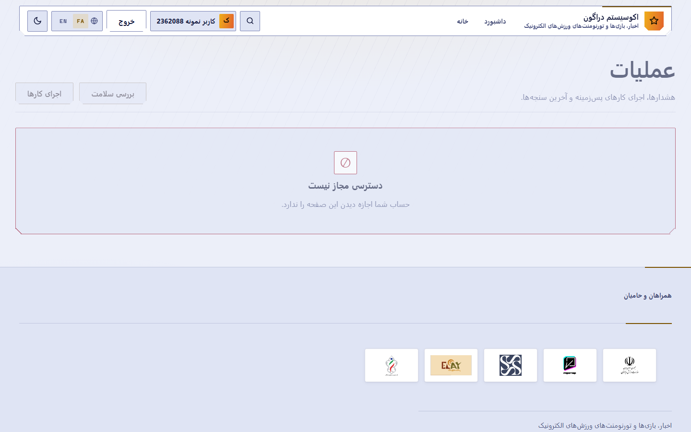

شکل — کنسول‌های اپراتوری برای حساب بدون مجوز، وضعیت «دسترسی مجاز نیست» نشان می‌دهند.

**حساس** سه نکته که باید بدانید:

۱. **پنهان‌بودن دکمه، مرز امنیتی نیست.** سرور مستقل از رابط کاربری، مجوز را روی هر مسیر و هر
   فراخوانی API بررسی می‌کند.
۲. **تایپ‌کردن مستقیم نشانی، دور زدن مجوز نیست.** صفحه باز می‌شود اما وضعیت «دسترسی مجاز
   نیست» نمایش داده می‌شود و درخواست API با کد **۴۰۳** رد می‌شود.
۳. **تخصیص نقش باید از مسیر مجاز انجام شود.** ویرایش مستقیم پایگاه داده یک رویه عملیاتی
   تأییدشده نیست: ممیزی ثبت نمی‌شود.

## ۴.۵ محدودیت مهم این نسخه — نبود رابط مدیریت نقش‌ها

**در نسخه فعلی هیچ صفحه‌ای برای تخصیص نقش وجود ندارد.** صفحه «کاربران» فقط جست‌وجو، مشاهده
با داده پوشانده‌شده، تعلیق و رفع تعلیق را ارائه می‌دهد.

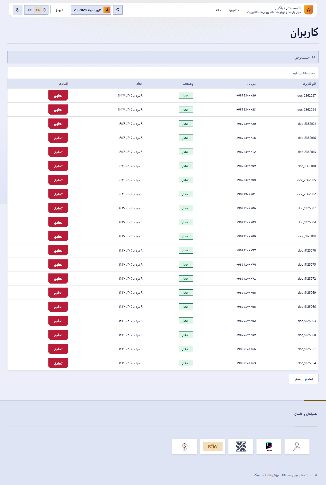

شکل — صفحه مدیریت کاربران؛ ستون یا کنترلی برای نقش‌ها وجود ندارد.

بنابراین:

- اگر به یک نقش عملیاتی نیاز دارید، **باید از اپراتور فنی مجاز درخواست کنید**؛
- اپراتور فنی رویه موقت مستندشده را در پیوست فنی دنبال می‌کند؛
- این محدودیت به‌عنوان نقص محصول ثبت شده است و رفع آن در یک کار جداگانه انجام خواهد شد.

## ۴.۶ Feature Gateهای فعلی

| تصمیم باز | متغیر محیطی | وضعیت پیش‌فرض |
|---|---|---|
| OD-014 | `STREAM_RIGHTS_POLICY_APPROVED` | بسته (fail-closed) |
| OD-007 | `PAID_TOURNAMENTS_ENABLED` | بسته (fail-closed) |
| OD-015 | `PAID_COURSES_ENABLED` | بسته (fail-closed) |
| OD-017 | `SOCIAL_BLOCKING_ENABLED` | بسته (fail-closed) |
| OD-024 | `MODERATION_APPEALS_ENABLED` | بسته (fail-closed) |
| OD-027 | `PUSH_NOTIFICATIONS_ENABLED` | بسته (fail-closed) |
| OD-019 | `PHYSICAL_FULFILLMENT_ENABLED` | بسته (fail-closed) |
| OD-020 | `ENTITLEMENT_REVOCATION_ENABLED` | بسته (fail-closed) |
| OD-008 | `NOTIFICATIONS_SMS_ENABLED` | بسته (fail-closed) |
| OD-026 | `ANALYTICS_EXTERNAL_ENABLED` | بسته (fail-closed) |

همه این دروازه‌ها **fail-closed** هستند: تا وقتی مقدارشان دقیقاً `true` نباشد، قابلیت بسته است.

---

# فصل ۵ — حساب کاربری و امنیت

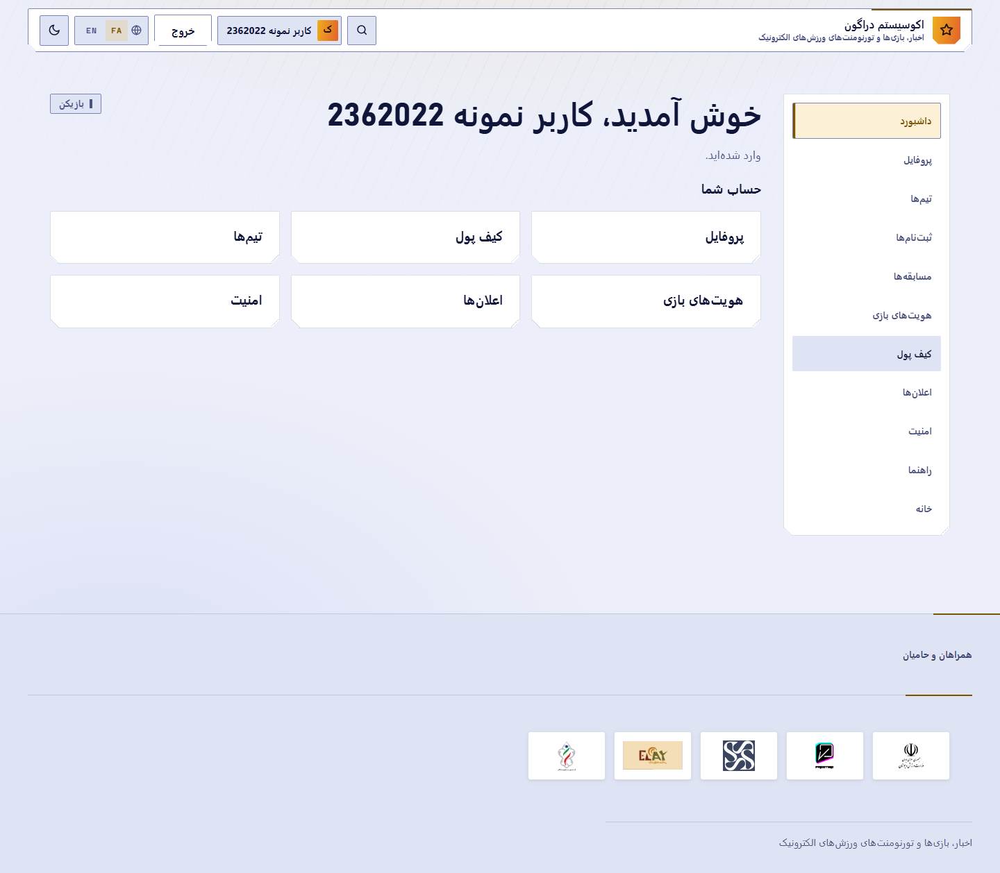

شکل — داشبورد حساب کاربری.

## ۵.۱ پروفایل

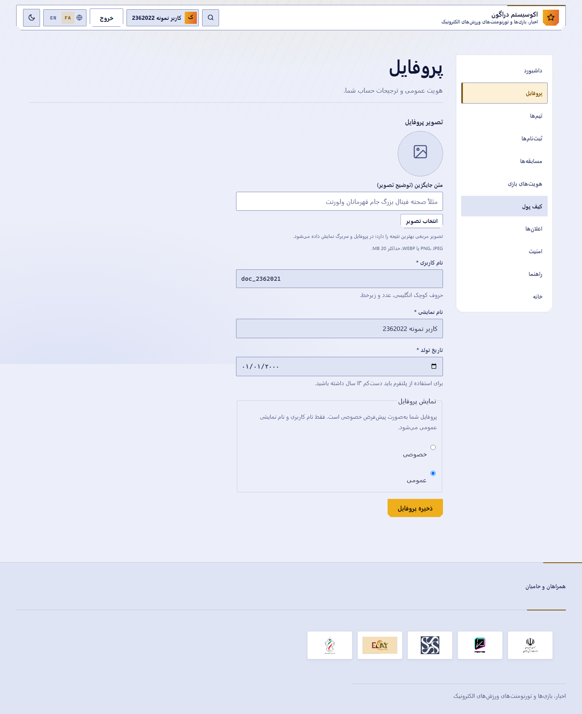

شکل — ویرایش پروفایل کاربر.

**هدف:** تکمیل هویت عمومی کاربر.
**نقش لازم:** کاربر ثبت‌نام‌شده. **مجوز:** ندارد.
**مسیر:** `/{locale}/account/profile`

نام کاربری، نام نمایشی، تاریخ تولد و سطح نمایش پروفایل تنظیم می‌شوند. تاریخ تولد برای
بررسی شرایط سنی تورنمنت‌ها استفاده می‌شود.

## ۵.۲ امنیت و نشست‌ها

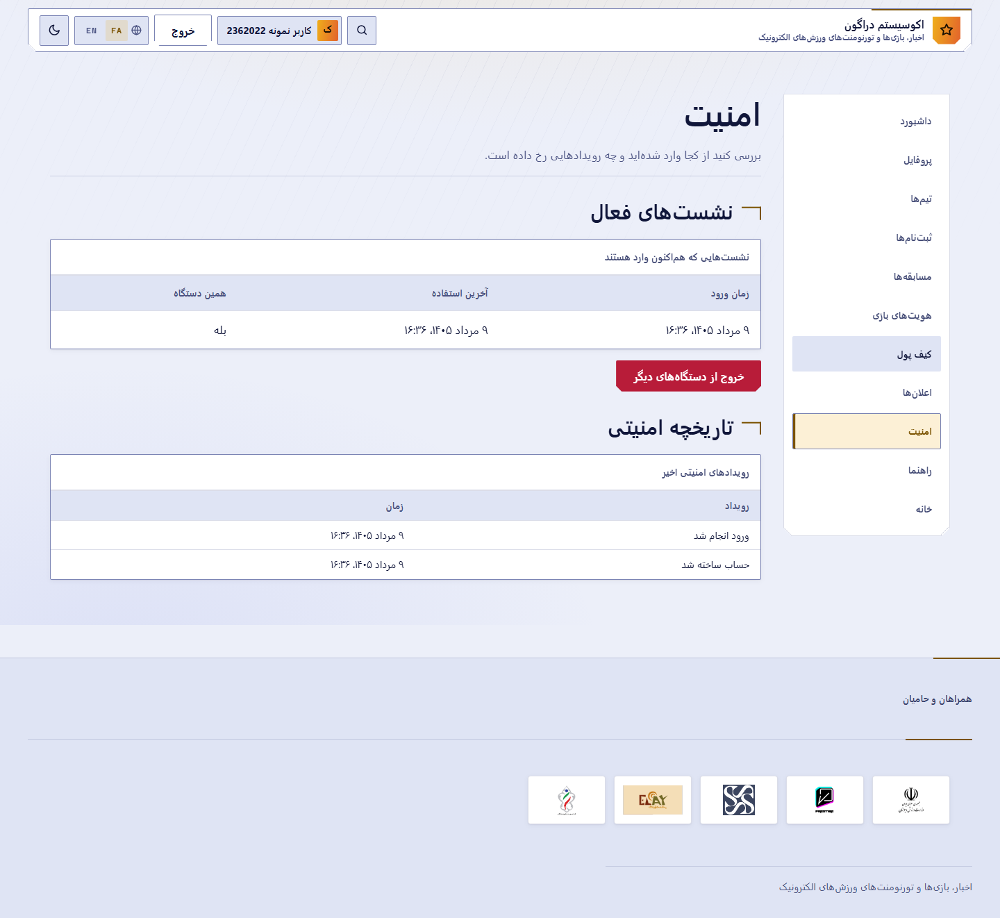

شکل — تنظیمات امنیتی و نشست‌های فعال.

نشست در کوکی `httpOnly` نگهداری می‌شود و اسکریپت صفحه به آن دسترسی ندارد. برای کارهای حساس،
ورود اخیر لازم است (`RECENT_AUTH_MINUTES`).

> **مسدود با تصمیم باز:** بازیابی حساب فقط «بررسی» است و هرگز به تأیید خودکار منجر نمی‌شود
> (OD-029). ایمیل به‌عنوان عامل بازیابی وجود ندارد (OD-003).

---

# فصل ۶ — پروفایل‌ها، تیم‌ها و شبکه اجتماعی

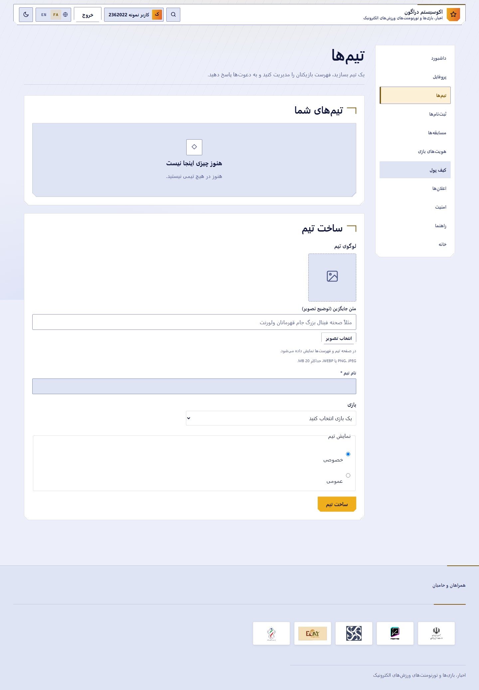

شکل — تیم‌های کاربر.

## ۶.۱ ساخت تیم

**هدف:** ساخت تیم برای شرکت گروهی در تورنمنت.
**نقش لازم:** کاربر ثبت‌نام‌شده با پروفایل کامل. **مجوز:** ندارد.
**مسیر:** `/{locale}/account/teams`

**مراحل**

۱. وارد بخش تیم‌ها شوید.
۲. تیم جدید بسازید (نام و نشانه‌های لازم).
۳. دعوت‌نامه برای بازیکنان بفرستید.
۴. بازیکن دعوت را می‌پذیرد و عضو می‌شود.

**نتیجه:** تیم ساخته می‌شود و مالک آن شما هستید. تیم به‌صورت پیش‌فرض خصوصی است و با تنظیم
عمومی در فهرست `/{locale}/teams` دیده می‌شود.

## ۶.۲ شناسه‌های بازی

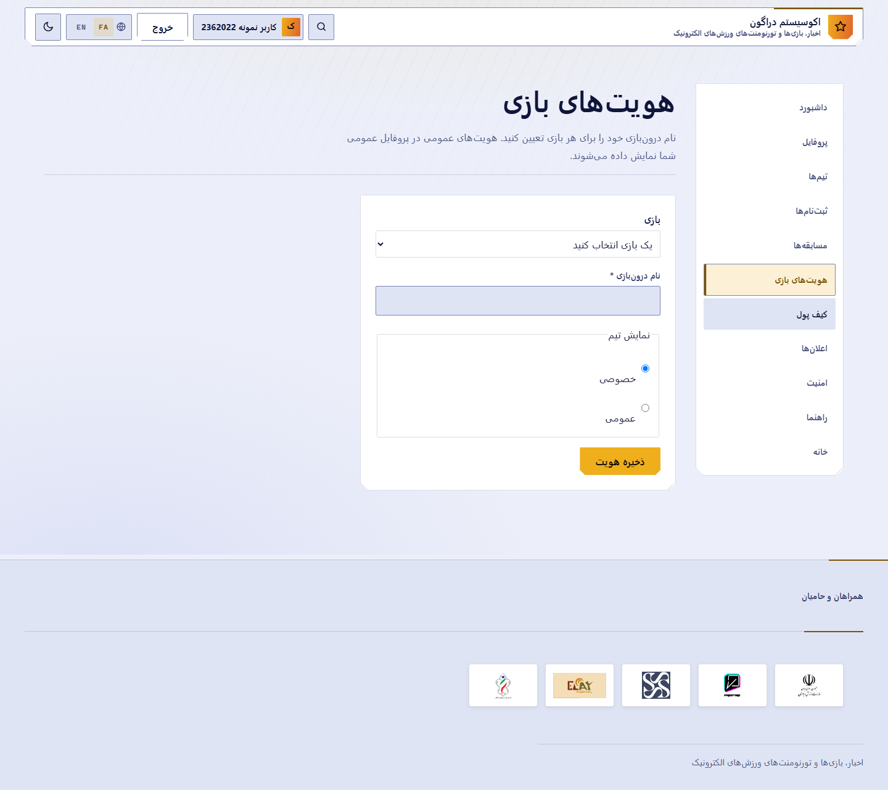

شکل — شناسه‌های بازی کاربر.

برخی تورنمنت‌ها داشتن شناسه بازی معتبر را شرط ثبت‌نام قرار می‌دهند.

---

# فصل ۷ — بازی‌ها، محتوا و جست‌وجو

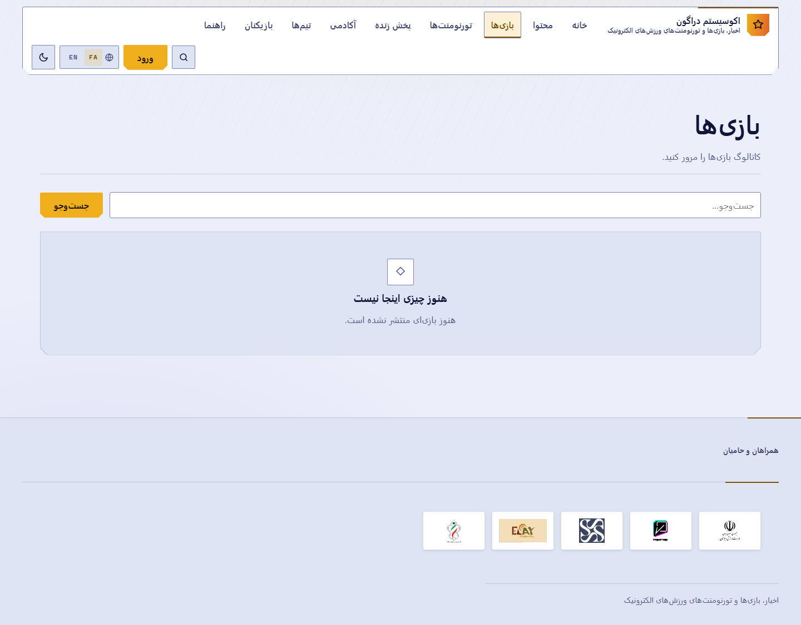

شکل — فهرست بازی‌های منتشرشده.

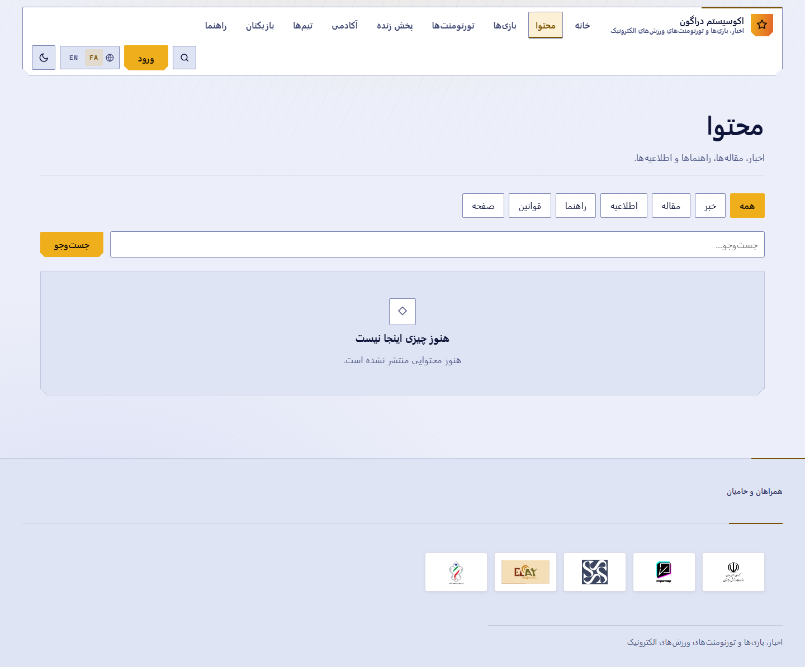

شکل — بخش محتوا و اخبار.

## ۷.۱ جست‌وجوی سراسری

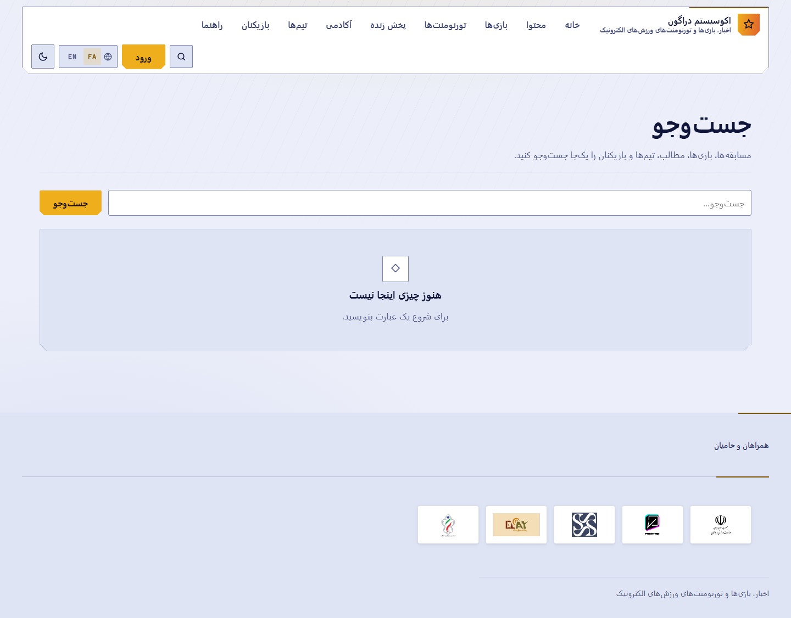

شکل — جست‌وجوی سراسری.

## ۷.۲ مدیریت محتوا **اپراتور**

**مجوز:** `content.write` برای نگارش، `content.publish` برای انتشار.
**مسیر:** `/{locale}/admin/content`

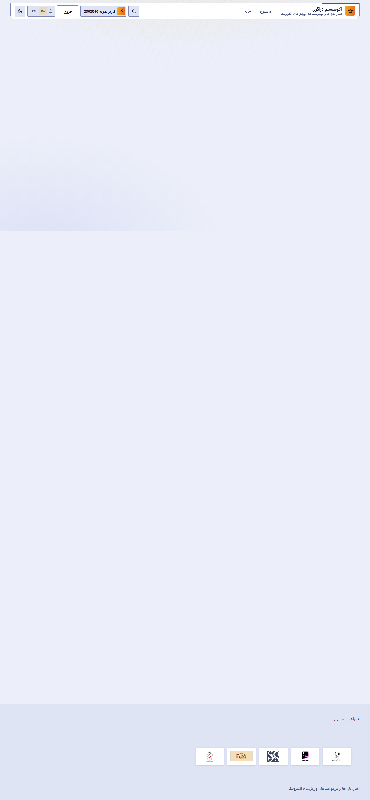

شکل — کنسول محتوا.

نقش‌های محتوا جدا هستند: نویسنده و ویراستار پیش‌نویس می‌سازند، اما فقط منتشرکننده می‌تواند
منتشر کند، زمان‌بندی کند یا از انتشار خارج کند.

## ۷.۳ مدیریت بازی‌ها **اپراتور**

**مجوز:** `games.manage`. **مسیر:** `/{locale}/admin/games`

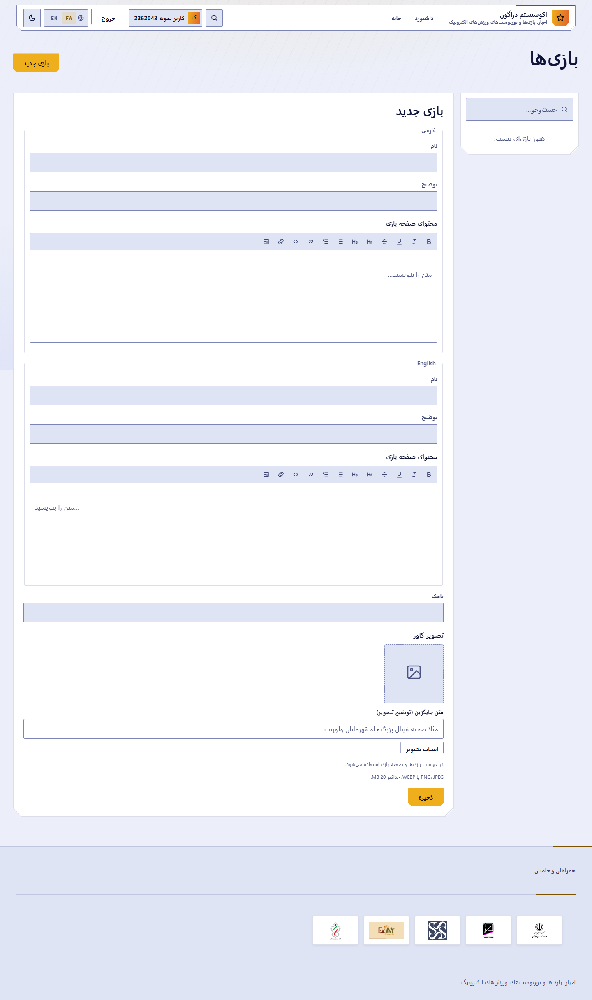

شکل — کنسول بازی‌ها.

---

# فصل ۸ — مسابقات و رقابت‌ها

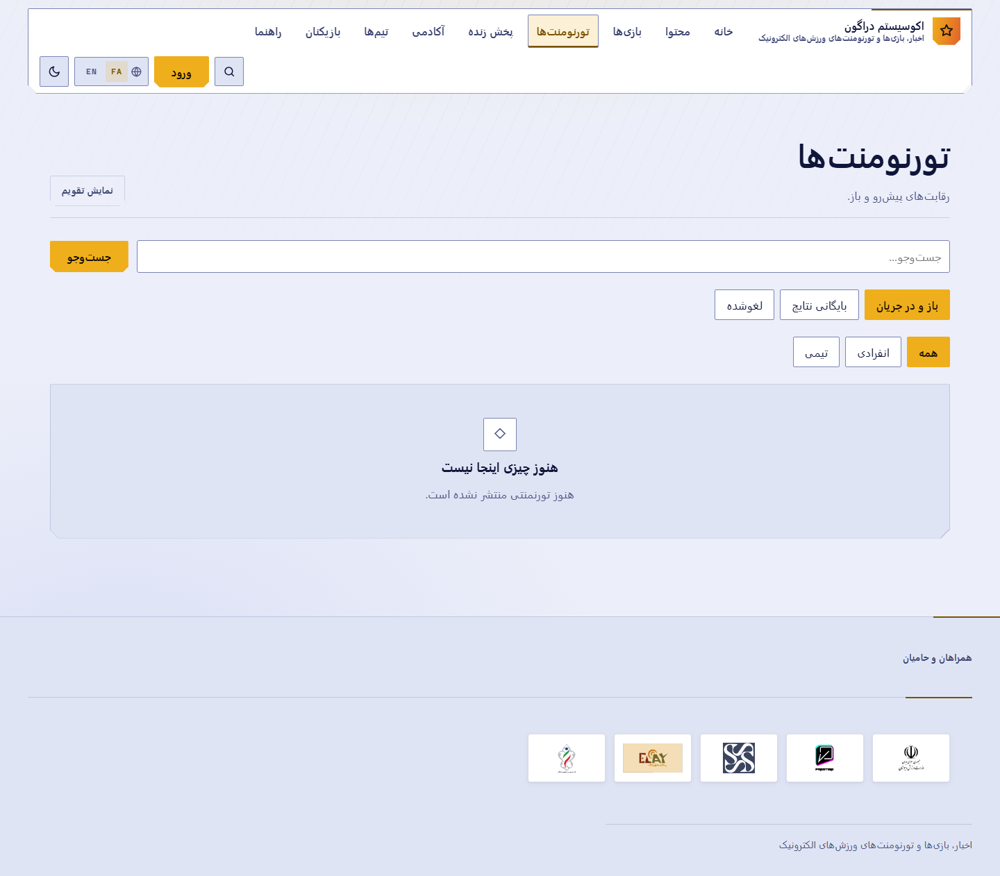

شکل — فهرست تورنمنت‌های عمومی.

## ۸.۱ ساخت تورنمنت **اپراتور**

**هدف:** ایجاد و انتشار یک تورنمنت.
**نقش لازم:** `tournament_administrator` یا `tournament_organizer`.
**مجوز:** `tournament.manage`.
**پیش‌نیاز:** یک بازی **منتشرشده** باید وجود داشته باشد.
**مسیر:** `/{locale}/admin/tournaments`

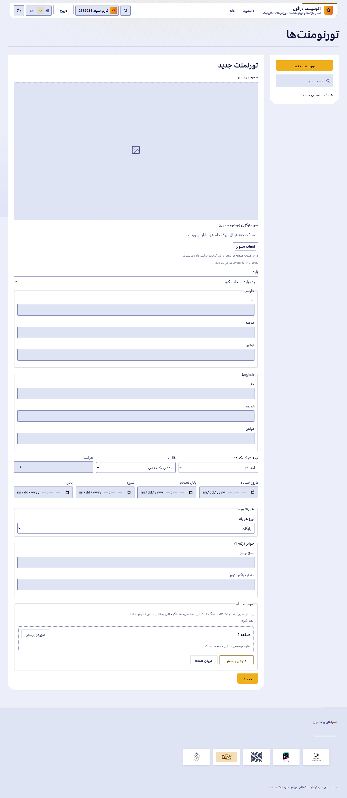

شکل — کنسول مدیریت تورنمنت‌ها.

**مراحل**

۱. از داشبورد، کارت «تورنمنت‌ها» را باز کنید.
۲. تورنمنت جدید بسازید: بازی، عنوان و خلاصه فارسی و انگلیسی، ظرفیت، حالت تأیید، بازه ثبت‌نام
   و بازه برگزاری.
۳. قوانین را در هر دو زبان وارد کنید.
۴. تورنمنت را به وضعیت منتشرشده منتقل کنید.

**نتیجه:** تورنمنت در فهرست عمومی دیده می‌شود و در بازه ثبت‌نام قابل ثبت‌نام است.

**خطاهای رایج**

| نشانه | علت |
|---|---|
| بازی در فهرست نیست | بازی منتشر نشده است |
| ثبت‌نام باز نمی‌شود | زمان جاری خارج از بازه ثبت‌نام است |
| گزینه ورودی پولی نیست | **بسته با Feature Gate** — `PAID_TOURNAMENTS_ENABLED` (OD-007) |

## ۸.۲ میز کار برگزارکننده

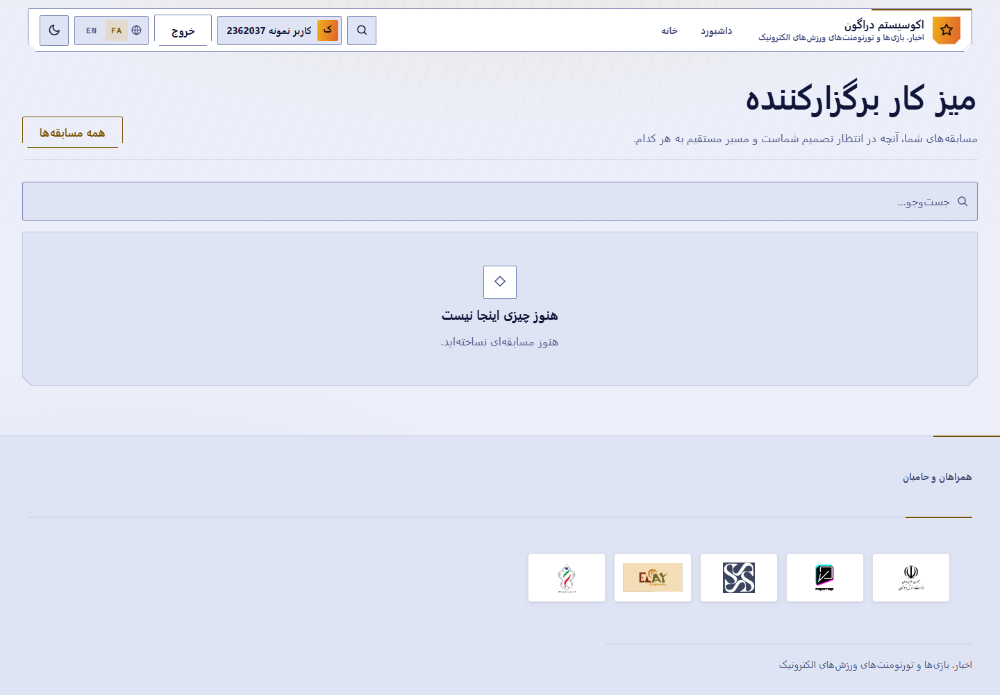

شکل — میز کار برگزارکننده: نمای «چه چیزی نیاز به من دارد».

---

# فصل ۹ — ثبت‌نام‌ها، برنامه مسابقات و نتایج

## ۹.۱ ثبت‌نام کاربر **کاربر**

**مسیر:** صفحه تورنمنت → ثبت‌نام.

پس از ثبت‌نام، وضعیت در `/{locale}/account/registrations` دیده می‌شود.


شکل — ثبت‌نام‌های تورنمنت و تاریخچه وضعیت.

تاریخچه وضعیت به‌صورت افزودنی نگهداری می‌شود. **دلیل تصمیم کارشناسان و هویت تصمیم‌گیرنده به
شرکت‌کننده نشان داده نمی‌شود؛** فقط نقش اقدام‌کننده (شرکت‌کننده، کارشناس، سامانه) نمایش داده
می‌شود.

## ۹.۲ برنامه مسابقات **کاربر**

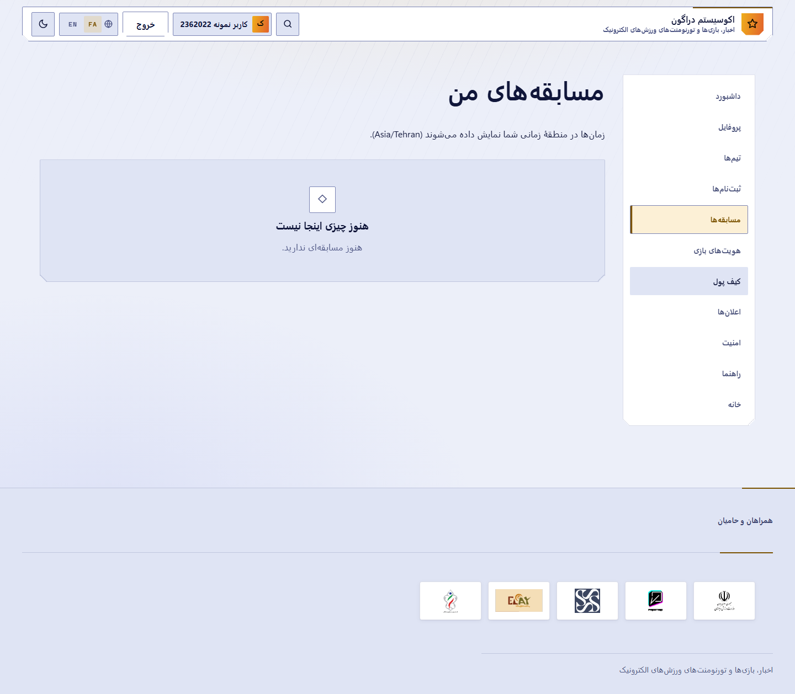

شکل — برنامه مسابقات کاربر.

زمان‌ها به‌صورت UTC ذخیره و در منطقه زمانی خود کاربر نمایش داده می‌شوند. اگر زمان مسابقه‌ای
تغییر کند، تغییر علامت‌گذاری می‌شود و زمان قبلی هم نشان داده می‌شود — اما **دلیل تغییر که
یادداشت کارشناسی است، نمایش داده نمی‌شود**.

## ۹.۳ تأیید ثبت‌نام‌ها **اپراتور**

**مجوز:** `tournament.manage`.
**مسیر:** `/{locale}/admin/tournaments/{id}/registrations`

تصمیم‌های ممکن: تأیید، رد، انتقال به لیست انتظار، ارتقا از لیست انتظار، لغو. رد و لغو
**دلیل الزامی** دارند.

---

# فصل ۱۰ — ساخت و مدیریت دوره آموزشی

> این فصل پاسخ مستقیم پرسش «چرا نمی‌توانم دوره بسازم؟» است.

## ۱۰.۱ چرا نمی‌توانم دوره بسازم؟

سه علت متفاوت وجود دارد و هر کدام راه‌حل خودش را دارد.

### علت یکم — نداشتن مجوز `education.manage`

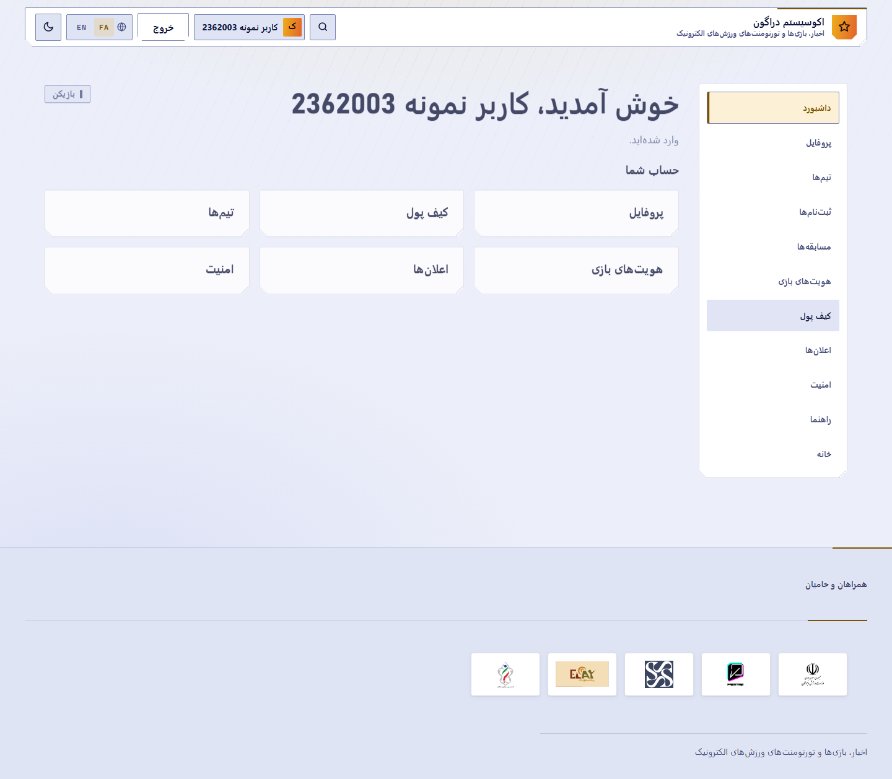

شکل — داشبورد حساب عادی: هیچ کارت «دوره‌ها» نمایش داده نمی‌شود.

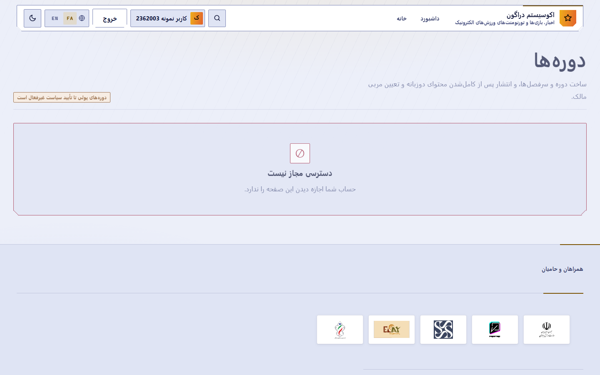

شکل — ورود مستقیم به نشانی کنسول دوره‌ها: صفحه باز می‌شود اما «دسترسی مجاز نیست» نمایش داده
می‌شود.

**جدول تشخیص**

| نشانه مشاهده‌شده | علت واقعی | راه بررسی | نقش/مجوز لازم | پیکربندی لازم | راه‌حل امن | نقص یا رفتار مورد انتظار؟ |
|---|---|---|---|---|---|---|
| کارت «دوره‌ها» در داشبورد نیست | حساب مجوز `education.manage` ندارد | ورود به `/{locale}/account`؛ نبود کارت | نقش `education_manager` | ندارد | درخواست نقش از اپراتور فنی مجاز | رفتار مورد انتظار |
| نشانی مستقیم «دسترسی مجاز نیست» می‌دهد | همان علت | باز کردن `/{locale}/admin/courses` | همان | ندارد | همان | رفتار مورد انتظار (پنهان‌سازی مرز امنیتی نیست) |
| نقش را نمی‌توان از رابط کاربری داد | **رابط تخصیص نقش وجود ندارد** | جست‌وجو در صفحه کاربران | `roles.assign` | ندارد | رویه موقت اپراتور فنی | **نقص محصول تأییدشده** |
| «دوره پولی» غیرفعال است | Feature Gate بسته | نشان روی کنسول دوره‌ها | — | `PAID_COURSES_ENABLED` (OD-015) | تا تأیید سیاست، دوره رایگان بسازید | رفتار مورد انتظار |
| انتشار دوره رد می‌شود | چرخه یا پیش‌نیازها کامل نیست | پیام خطای انتشار | `education.manage` | ندارد | بخش ۱۰٫۴ | رفتار مورد انتظار |

**فنی** رویه تخصیص نقش در `THIRD_PARTY_SETUP_FA.md`، بخش «راهکار موقت برای اپراتور فنی» آمده
است. **کاربر عادی و مدیر غیرفنی نباید API را دستی فراخوانی کنند.**

### علت دوم — پس از دریافت نقش

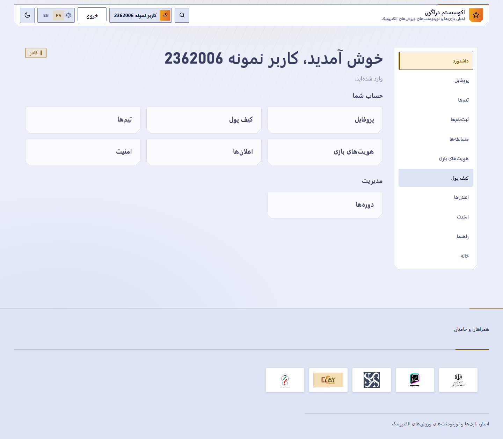

شکل — پس از دریافت نقش «مدیر آموزش»، کارت «دوره‌ها» در داشبورد ظاهر می‌شود.

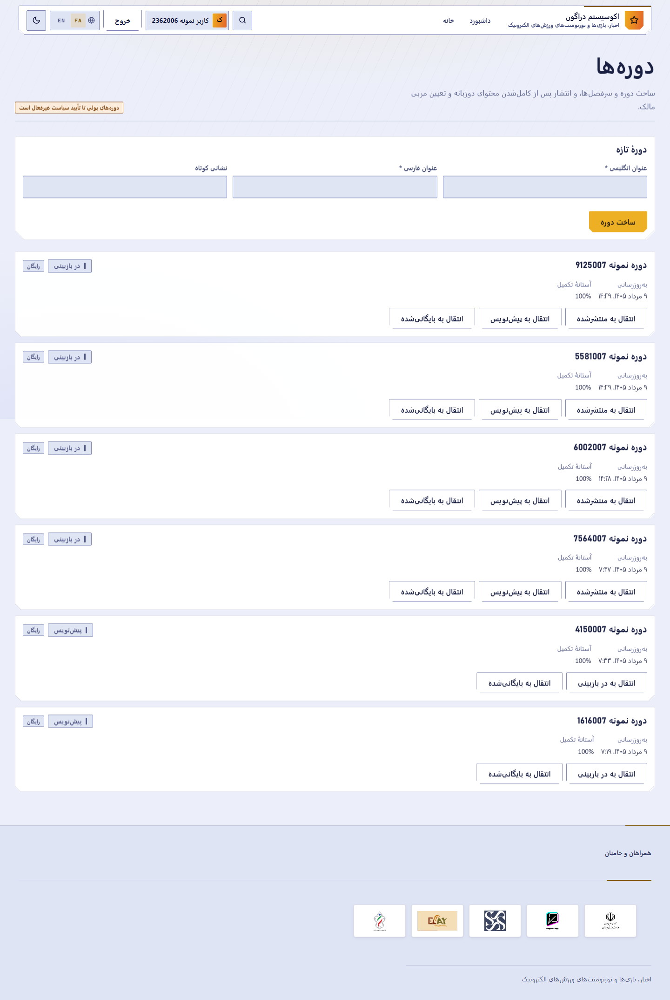

شکل — کنسول مدیریت دوره‌ها برای کاربر دارای دسترسی.

### علت سوم — چرخه انتشار

بیشتر کسانی که می‌گویند «دوره ساخته نمی‌شود» در واقع دوره را ساخته‌اند و **نمی‌توانند منتشرش
کنند**.

## ۱۰.۲ جریان کامل رفع اشکال دوره

```text
گزینه دوره‌ها دیده نمی‌شود
→ بررسی نقش و education.manage
→ در صورت نبود مجوز، ارجاع به اپراتور فنی
→ پس از تخصیص نقش، بررسی مسیر /{locale}/admin/courses
→ ساخت draft
→ انتقال draft به review
→ تکمیل coach، خلاصه فارسی و انگلیسی، حداقل یک درس و یک درس الزامی
→ انتشار از review
```

> **چرخه واقعی `draft ← review ← published` است.** انتقال مستقیم از `draft` به `published`
> پذیرفته نمی‌شود.

## ۱۰.۳ ساخت دوره **اپراتور**

**هدف:** ساخت یک دوره آموزشی.
**نقش لازم:** `education_manager`. **مجوز:** `education.manage`.
**پیش‌نیاز:** ندارد — ساخت پیش‌نویس هیچ فیلد اجباری‌ای ندارد.
**مسیر ورود:** `/{locale}/account` → کارت «دوره‌ها» → `/{locale}/admin/courses`

**مراحل**

۱. کنسول دوره‌ها را باز کنید.
۲. دوره جدید بسازید. دوره در وضعیت `draft` ساخته می‌شود.
۳. عنوان و خلاصه را در **هر دو زبان** فارسی و انگلیسی کامل کنید.
۴. درس‌ها را اضافه کنید؛ هر درس در هر دو زبان عنوان داشته باشد.
۵. حداقل یک درس را «الزامی» علامت بزنید تا در محاسبه تکمیل دوره بیاید.
۶. مربی (coach) را تعیین کنید و مطمئن شوید مربی **تأیید شده** است.
۷. دوره را به `review` منتقل کنید.
۸. از `review` منتشر کنید.

**وضعیت Production:** در دسترس. **دوره پولی** بسته است (OD-015).

## ۱۰.۴ پیش‌نیازهای انتشار

هنگام انتشار، سرور فهرست دقیق کمبودها را برمی‌گرداند:

| فیلد | پیام |
|---|---|
| `translations.fa.summary` | خلاصه فارسی لازم است |
| `translations.en.summary` | خلاصه انگلیسی لازم است |
| `coachId` | مربی مالک دوره را تعیین کنید |
| `lessons` | حداقل یک درس اضافه کنید |
| `lessons.required` | حداقل یک درس الزامی لازم است |

اگر مربی تعیین شده اما تأیید نشده باشد، خطای «مربی تأیید نشده است» برمی‌گردد. تأیید مربی از
مسیر مدیریت مربیان انجام می‌شود.

## ۱۰.۵ دوره پولی — بسته با Feature Gate

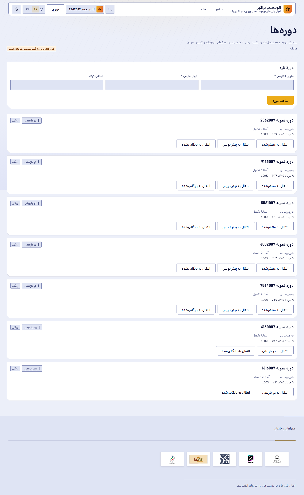

شکل — در پیکربندی پیش‌فرض، دوره پولی تا تأیید سیاست OD-015 غیرفعال است.

تا زمان تأیید سیاست مالکیت دوره، بازپرداخت و شرایط تجاری مربی، دوره نمی‌تواند قیمت داشته
باشد. قیمت دوره در صورت فعال‌شدن فقط با دراگون‌کوین است.

---

# فصل ۱۱ — تجربه دانشجو و پیشرفت دوره

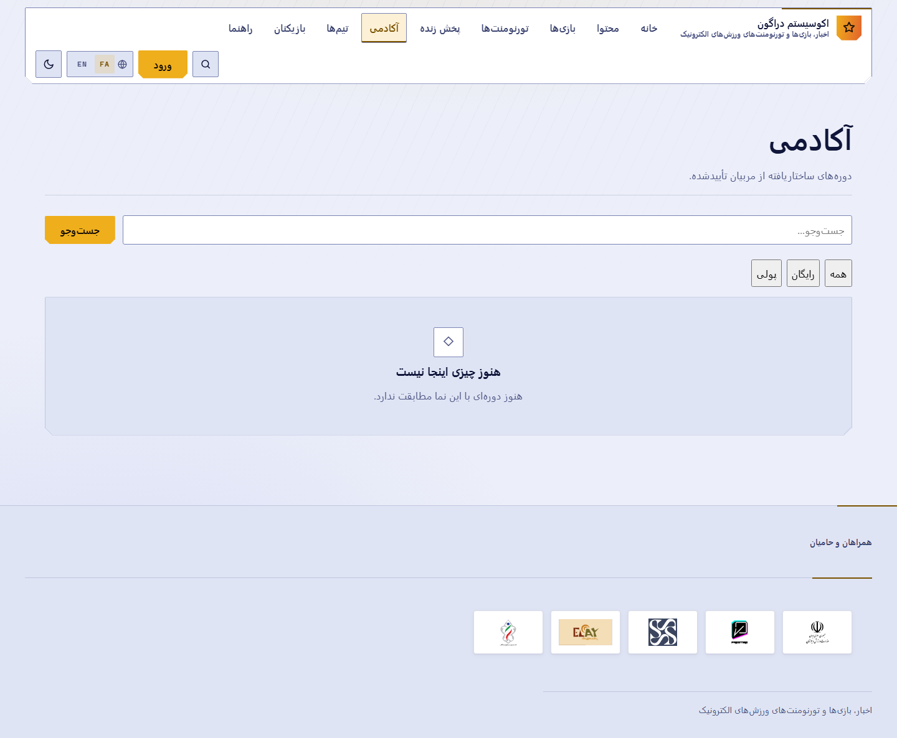

شکل — کاتالوگ دوره‌های آموزشی منتشرشده.

## ۱۱.۱ ثبت‌نام در دوره **کاربر**

**مسیر:** `/{locale}/academy` → صفحه دوره → ثبت‌نام.

دوره‌های رایگان بدون پرداخت فعال می‌شوند. دوره پولی در این نسخه **در دسترس نیست**.

## ۱۱.۲ پیشرفت و تکمیل

درس‌ها ترتیب و پیش‌نیاز دارند: درسی که پیش‌نیازش کامل نشده باشد **قفل** است و محتوایش
تحویل داده نمی‌شود. تکمیل دوره بر اساس درس‌های الزامی محاسبه می‌شود.

---

# فصل ۱۲ — ساخت و مدیریت عملیات پخش زنده

> این فصل پاسخ مستقیم پرسش «چرا نمی‌توانم پخش زنده بسازم یا مدیریت کنم؟» است.

## ۱۲.۱ واقعیت این نسخه — پیش از هر کار دیگری بخوانید

**حساس** این موارد از پیکربندی خود سرور خوانده شده‌اند، نه از حدس:

- اپراتور دارای مجوز **می‌تواند** رکورد پخش بسازد، زمان‌بندی کند و provision کند؛
- ارائه‌دهنده پیکربندی‌شده `stub` است؛
- این یک **شبیه‌سازی قطعی** است، نه ارائه‌دهنده پخش واقعی؛
- مقدار `STREAMING_PROVIDER=arvan` **عمداً رد می‌شود** و راه‌اندازی را متوقف می‌کند؛
- **پخش زنده واقعی با آروان در این نسخه پشتیبانی و تأیید نشده است**؛
- **OD-013** یکپارچه‌سازی ارائه‌دهنده را مسدود کرده است؛
- **OD-014** انتشار آرشیو، مدت نگهداری، حقوق پخش و رویه حذف محتوا را مسدود کرده است.

> هیچ خواننده‌ای نباید نتیجه بگیرد که می‌تواند یک پخش زنده واقعی آروان را آغاز کند.

## ۱۲.۲ چرا نمی‌توانم پخش زنده بسازم یا مدیریت کنم؟

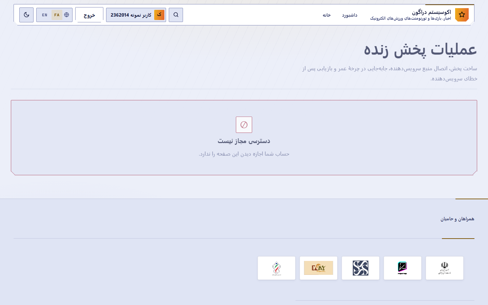

شکل — کنسول پخش زنده برای کاربر بدون دسترسی `stream.manage` قابل استفاده نیست.

**جدول تشخیص**

| نشانه مشاهده‌شده | علت واقعی | راه بررسی | نقش/مجوز لازم | پیکربندی لازم | راه‌حل امن | نقص یا رفتار مورد انتظار؟ |
|---|---|---|---|---|---|---|
| کارت «پخش زنده» در داشبورد نیست | نداشتن `stream.manage` | ورود به `/{locale}/account` | نقش `streaming_operator` | ندارد | درخواست نقش از اپراتور فنی | رفتار مورد انتظار |
| نشانی مستقیم «دسترسی مجاز نیست» می‌دهد | همان علت | `/{locale}/admin/streams` | همان | ندارد | همان | رفتار مورد انتظار |
| نقش را نمی‌توان از رابط کاربری داد | رابط تخصیص نقش وجود ندارد | صفحه کاربران | `roles.assign` | ندارد | رویه موقت اپراتور فنی | **نقص محصول تأییدشده** |
| پخش ساخته می‌شود ولی تماشاگر پخش واقعی نمی‌بیند | ارائه‌دهنده `stub` است | بخش ۱۲٫۱ همین فصل؛ برای بررسی فنی، اپراتور فنی به `THIRD_PARTY_SETUP_FA.md` مراجعه می‌کند | `stream.manage` | — | تا رفع OD-013 امکان‌پذیر نیست | **ارائه‌دهنده در دسترس نیست** |
| آرشیو یا حذف محتوا کار نمی‌کند | دروازه حقوق پخش بسته است | همان مرجع فنی | — | `STREAM_RIGHTS_POLICY_APPROVED` (OD-014) | تا تأیید سیاست ممکن نیست | **مسدود با تصمیم باز** |
| تنظیم `STREAMING_PROVIDER=arvan` سرور را بالا نمی‌آورد | رد عمدی در پیکربندی | پیام خطای راه‌اندازی | — | — | مقدار را `stub` بگذارید | رفتار مورد انتظار |

## ۱۲.۳ کنسول پخش **اپراتور**


شکل — کنسول عملیات پخش زنده برای اپراتور دارای دسترسی.

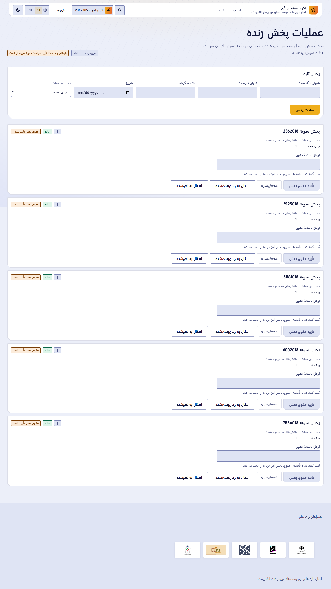

شکل — ارائه‌دهنده پیکربندی‌شده «stub» است؛ این یک شبیه‌سازی قطعی است و پخش واقعی نیست.

**هدف:** ساخت و مدیریت رکورد پخش.
**نقش لازم:** `streaming_operator`. **مجوز:** `stream.manage`.
**مسیر:** `/{locale}/admin/streams`

**مراحل**

۱. کنسول پخش را باز کنید.
۲. پخش جدید بسازید (عنوان دوزبانه، حالت دسترسی عمومی یا نیازمند ورود).
۳. زمان‌بندی کنید.
۴. در صورت نیاز، اتصال به ارائه‌دهنده را provision کنید.
۵. چرخه وضعیت را مدیریت کنید.

**چرخه وضعیت پخش:** `draft`، `scheduled`، `live`، `ended`، `cancelled`، `archived`، `failed`.
وضعیت همگام‌سازی با ارائه‌دهنده: `unlinked`، `provisioning`، `ready`، `failed`.

**وضعیت Production:** **ارائه‌دهنده در دسترس نیست.** عملیات فراداده کار می‌کند؛ پخش واقعی خیر.

## ۱۲.۴ صفحه عمومی پخش **کاربر**

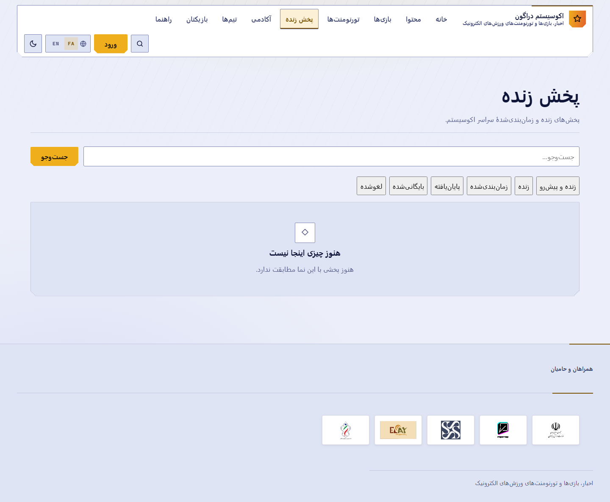

شکل — فهرست پخش‌های زنده.

---

# فصل ۱۳ — گفت‌وگوی زنده و تعدیل محتوا

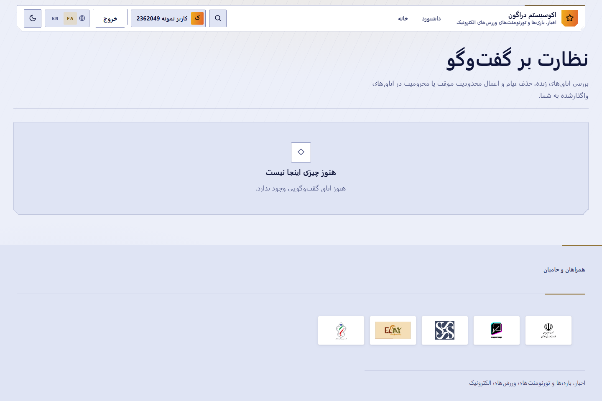

شکل — کنسول تعدیل گفت‌وگوی زنده.

**نقش لازم:** `live_chat_moderator`. **مجوز:** `chat.moderate`.

**حساس** این نقش عمداً محدود است: ناظر گفت‌وگوی زنده **نمی‌تواند حساب کاربری را تعلیق کند**
و هیچ اختیار تعدیل در سطح پلتفرم ندارد. اختیارات آن در اتاق‌های تخصیص‌یافته است: سکوت موقت،
محرومیت، حذف پیام، و بررسی گزارش‌ها.

تفاوت با فصل ۱۲: **مدیریت پخش** (`stream.manage`) و **تعدیل گفت‌وگو** (`chat.moderate`) دو
مجوز جدا هستند و یکی دیگری را شامل نمی‌شود.

---

# فصل ۱۴ — جامعه، پست‌ها، نظرات و گزارش‌ها

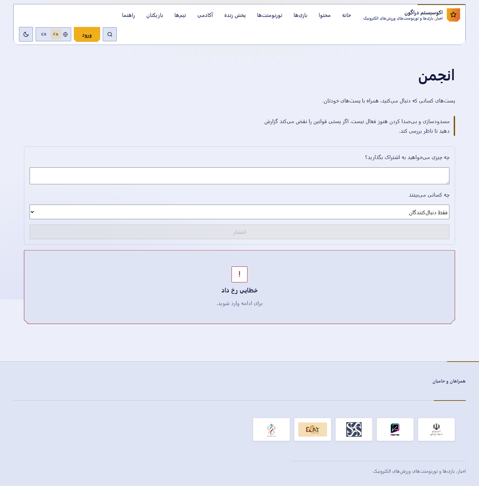

شکل — خوراک جامعه کاربری.

## ۱۴.۱ قابلیت‌های کاربر

دنبال‌کردن، انتشار پست با سطح مخاطب، نظر، واکنش و گزارش تخلف.

## ۱۴.۲ محدودیت‌ها

> **مسدود با تصمیم باز (OD-017):** در این نسخه **هیچ قابلیت مسدودسازی یا بی‌صداکردن کاربر
> وجود ندارد** — نه مسیری، نه مجموعه‌ای، نه محدودیت نیمه‌اعمال‌شده. دنبال‌کردن، انتشار،
> گزارش و حذف توسط ناظر تحت تأثیر نیستند.

> **مسدود با تصمیم باز (OD-024):** اعتراض به تصمیم تعدیل در محصول ممکن نیست و کنسول تعدیل
> همین را می‌گوید، به‌جای پذیرفتن اعتراضی که هیچ فرایندی آن را پردازش نمی‌کند.

## ۱۴.۳ تعدیل جامعه **اپراتور**

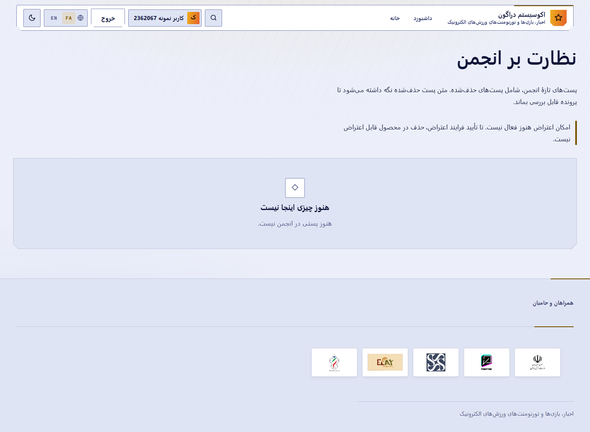

شکل — تعدیل جامعه کاربری.

**مجوز:** `moderation.manage`.

---

# فصل ۱۵ — فروشگاه، سبد، سفارش و موجودی

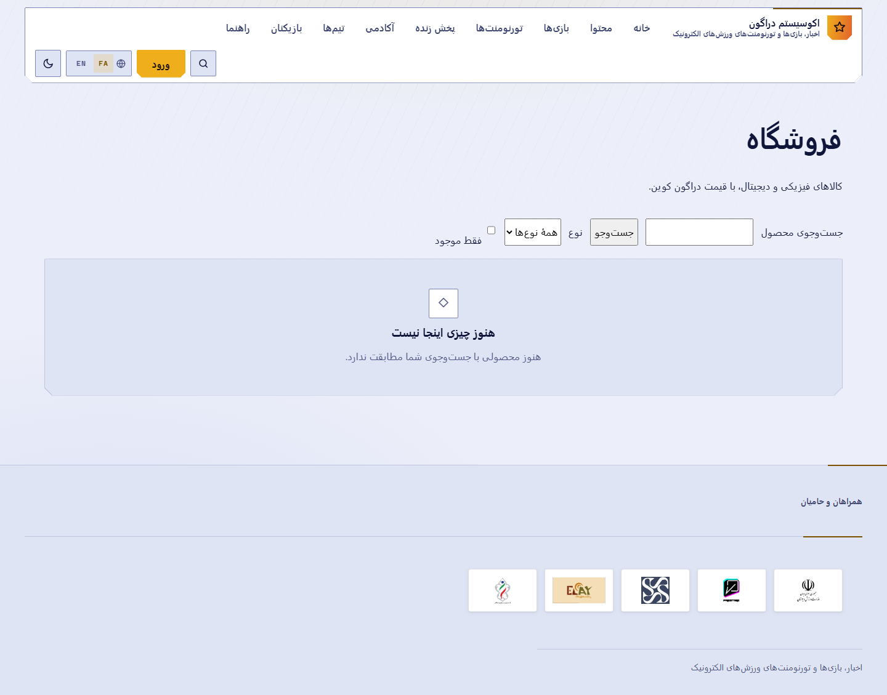

شکل — کاتالوگ فروشگاه.

## ۱۵.۱ خرید **کاربر**

کاتالوگ → سبد → تسویه → سفارش. سفارش‌ها در `/{locale}/account/orders` دیده می‌شوند.

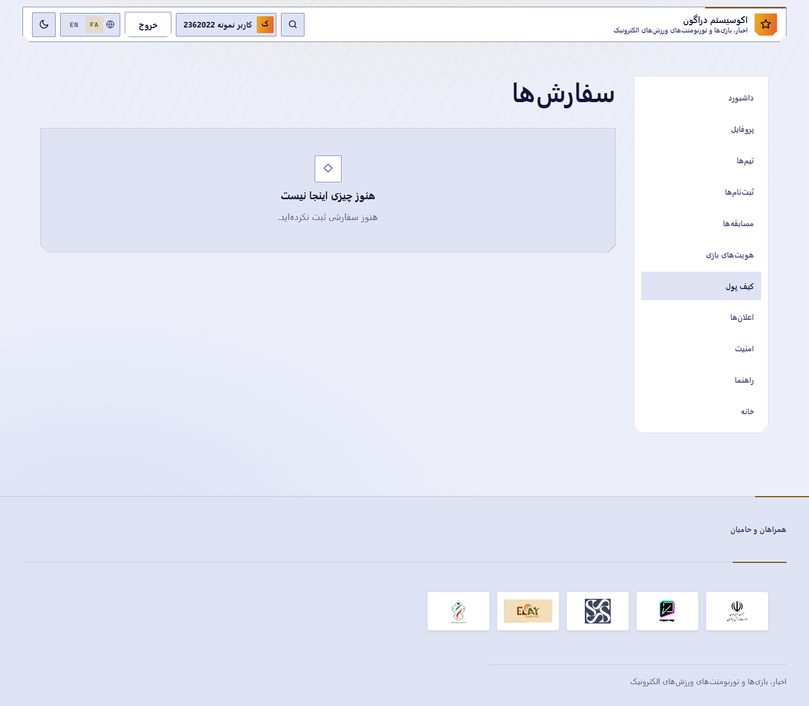

شکل — سفارش‌های فروشگاه.

## ۱۵.۲ محدودیت‌ها

> **بسته با Feature Gate (OD-019):** سبدی که کالای **فیزیکی** دارد قابل تسویه نیست و
> فرایند ارسال پیش نمی‌رود، چون هیچ شرکت حمل، منطقه سرویس، قاعده قیمت ارسال یا سطح سرویس
> تأیید نشده است. **هیچ یکپارچه‌سازی با شرکت حمل در کد وجود ندارد.** کاتالوگ فیزیکی و
> موجودی آن همچنان وجود دارند؛ کالای دیجیتال تحت تأثیر نیست.

> **بسته با Feature Gate (OD-020):** ابطال حق دسترسی دیجیتال ممکن نیست.

## ۱۵.۳ عملیات فروشگاه **اپراتور**

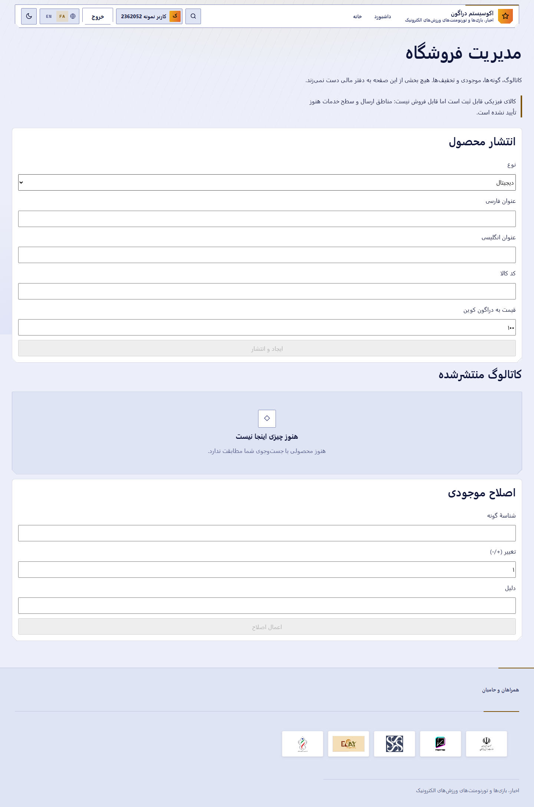

شکل — کنسول فروشگاه و کاتالوگ.

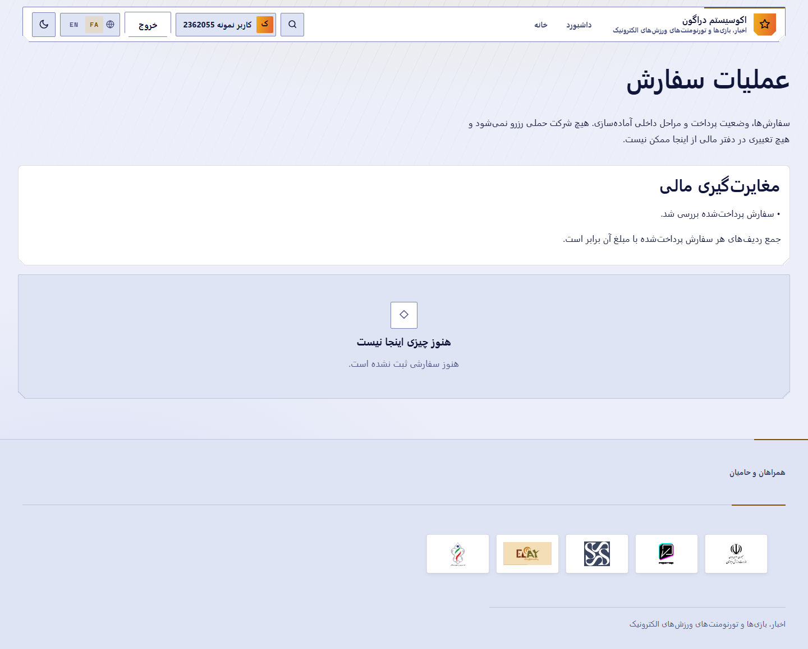

شکل — عملیات سفارش‌ها.

**نقش:** `shop_operator`. **مجوز:** `store.manage`.

**حساس** این نقش **نمی‌تواند دفتر کل را تغییر دهد یا پرداخت جایزه انجام دهد**. اپراتور
فروشگاه کالا را جابه‌جا می‌کند، نه پول را.

---

# فصل ۱۶ — کیف پول، پرداخت و Dragon Coin

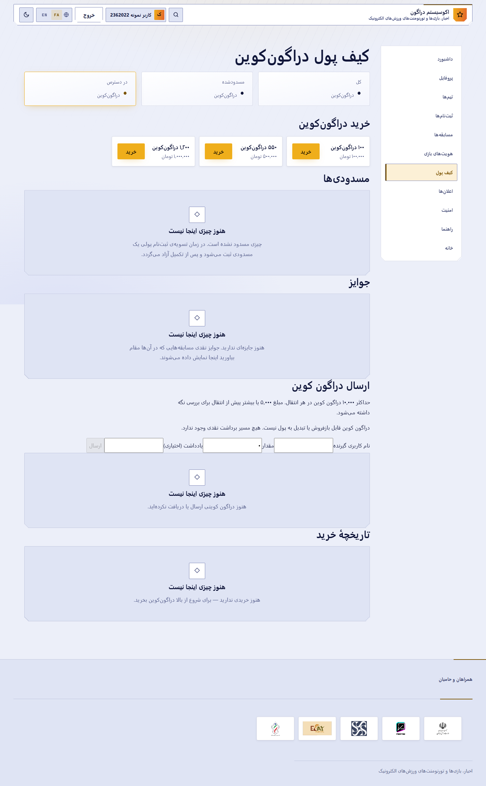

شکل — کیف پول و موجودی دراگون‌کوین.

## ۱۶.۱ مفاهیم

- **دراگون‌کوین** واحد اقتصاد داخلی است.
- **نگه‌داشت (hold)** مبلغی است که موقتاً رزرو می‌شود و با تکمیل یا لغو عملیات آزاد می‌شود.
- دفتر کل **دوطرفه و تغییرناپذیر** است: رکورد مالی حذف یا بازنویسی نمی‌شود.

## ۱۶.۲ محدودیت مهم

> **برداشت نقدی و تبدیل دراگون‌کوین به وجه نقد وجود ندارد.** کیف پول همین را صریح اعلام
> می‌کند.

## ۱۶.۳ پرداخت

درگاه پرداخت در این نسخه **شبیه‌سازی‌شده** است. در تولید، mock به‌صورت پیش‌فرض خاموش است.

---

# فصل ۱۷ — پاداش، انتقال، جایزه و پرداخت جایزه

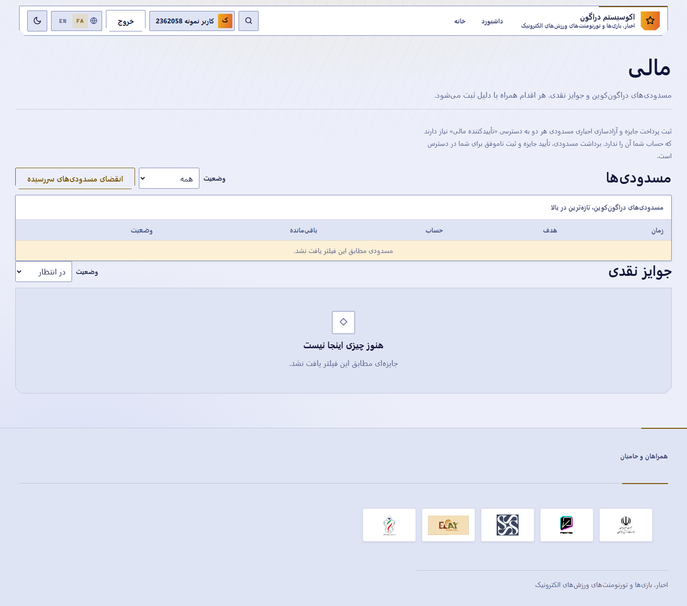

شکل — کنسول مالی.

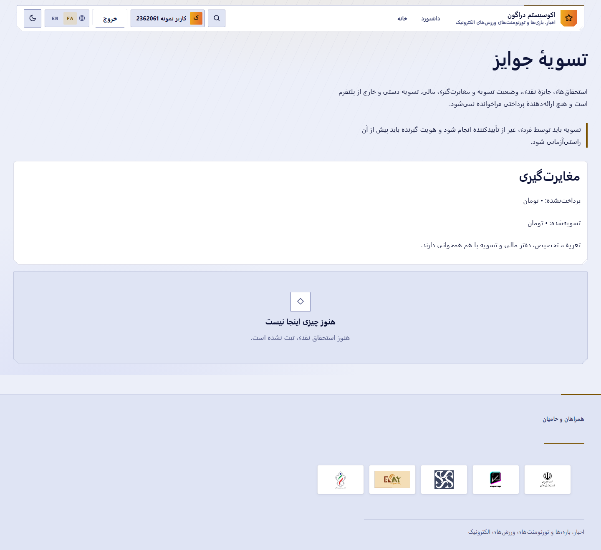

شکل — تسویه جوایز.

## ۱۷.۱ کنترل دوگانه

**حساس** تفکیک عمدی نقش‌ها:

- `finance_operator` (مجوز `finance.manage`) عملیات را **آغاز** می‌کند؛
- `financial_approver` (مجوز `finance.approve`) آن را **تأیید** می‌کند.

یک نفر نمی‌تواند هر دو کار را روی یک اقدام پرریسک انجام دهد. کلیدهای پیکربندی با پیشوند
`finance.`، `security.` و `payout.` پرریسک هستند و کنترل دوگانه لازم دارند.

## ۱۷.۲ انتقال بین کاربران

انتقال دراگون‌کوین با محدودیت‌های تعریف‌شده انجام می‌شود و کیف پول همین محدودیت‌ها را نمایش
می‌دهد.

---

# فصل ۱۸ — پشتیبانی کاربران

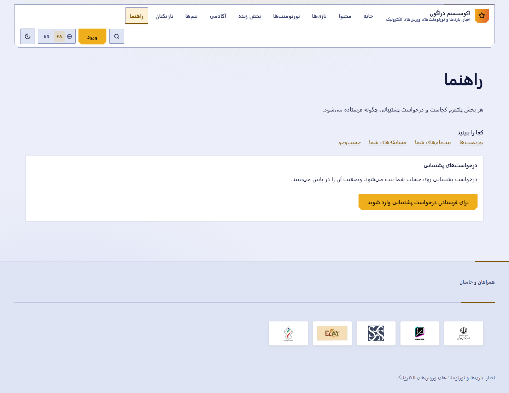

شکل — صفحه راهنما و ثبت درخواست پشتیبانی.

## ۱۸.۱ ثبت درخواست **کاربر**

**مسیر:** `/{locale}/help`. ثبت درخواست نیازمند ورود است.

دسته‌های موجود: «حساب کاربری»، «پرداخت»، «سایر». درخواست روی حساب شما ثبت می‌شود و وضعیت آن
را در همان صفحه می‌بینید.

> این صفحه **پرسش‌های متداول ندارد**. محتوای تأییدشده‌ای برای آن وجود ندارد و متن حدسی
> نوشته نشده است. همچنین هیچ وعده زمان پاسخ، شماره تماس یا نشانی ایمیل در محصول وجود ندارد.

## ۱۸.۲ صف پشتیبانی **اپراتور**

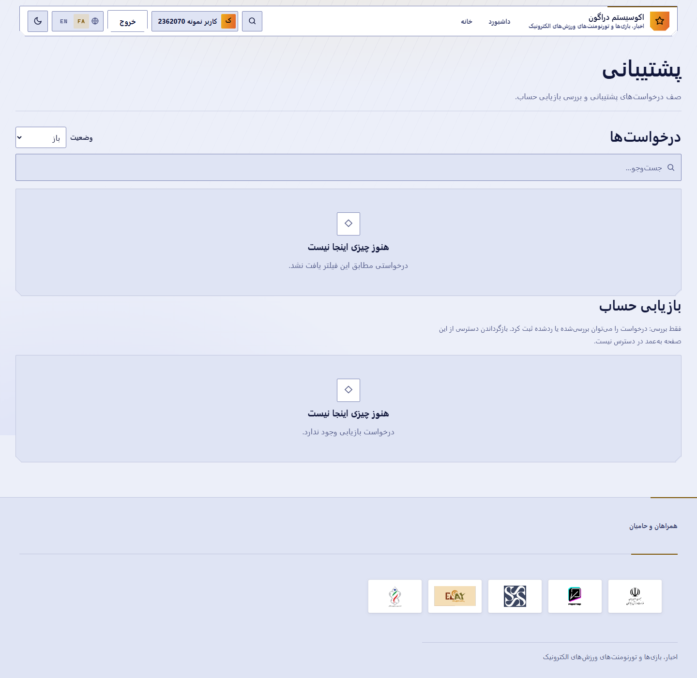

شکل — صف درخواست‌های پشتیبانی.

**مجوز:** `support.manage`.

**حساس** یادداشت کارشناسی و هویت کارشناس مسئول **به درخواست‌کننده نشان داده نمی‌شود**.

بازیابی حساب فقط **بررسی** است: می‌توان «بررسی‌شده» یا «ردشده» ثبت کرد. **بازگرداندن دسترسی
از این صفحه به‌عمد ممکن نیست** (OD-029).

---

# فصل ۱۹ — مدیریت و عملیات سامانه

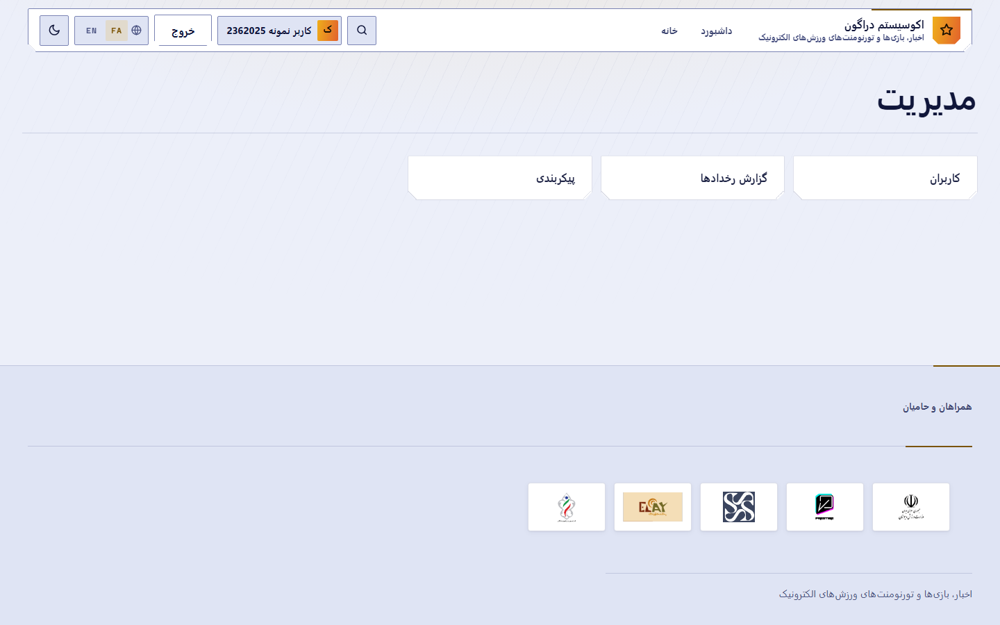

شکل — صفحه فرود بخش مدیریت با کارت‌های مجاز.

## ۱۹.۱ کاربران


شکل — فهرست کاربران با داده‌های پوشانده‌شده.

**مجوز:** `users.read` برای مشاهده، `users.suspend` برای تعلیق. تعلیق **دلیل الزامی** دارد.

> **یادآوری:** این صفحه رابط تخصیص نقش ندارد. فصل ۴٫۵ را ببینید.

## ۱۹.۲ ممیزی

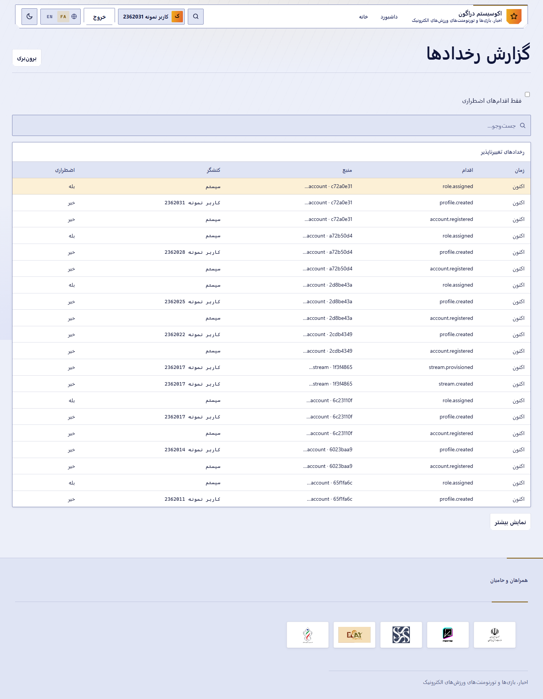

شکل — گزارش ممیزی رویدادها.

**مجوز:** `audit.read`؛ برون‌بری با `audit.export`.

## ۱۹.۳ پیکربندی

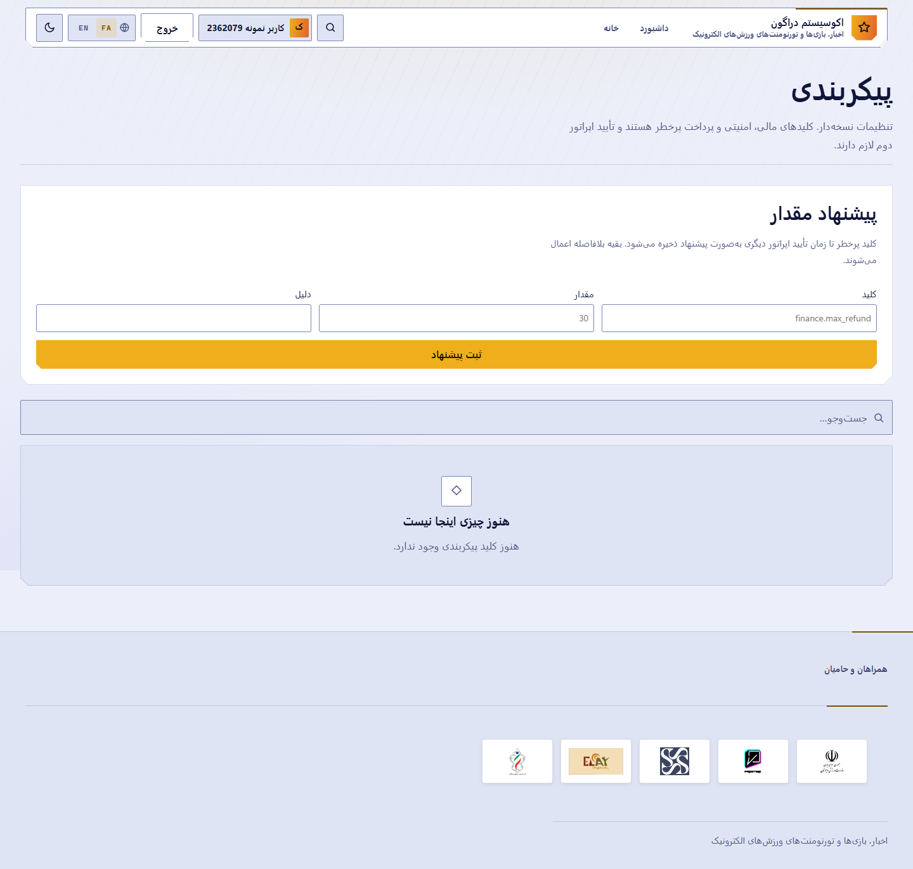

شکل — پیشنهاد و تأیید پیکربندی.

**مجوز:** `config.read`، `config.propose`، `config.approve`. کلیدهای پرریسک کنترل دوگانه
لازم دارند.

## ۱۹.۴ عملیات

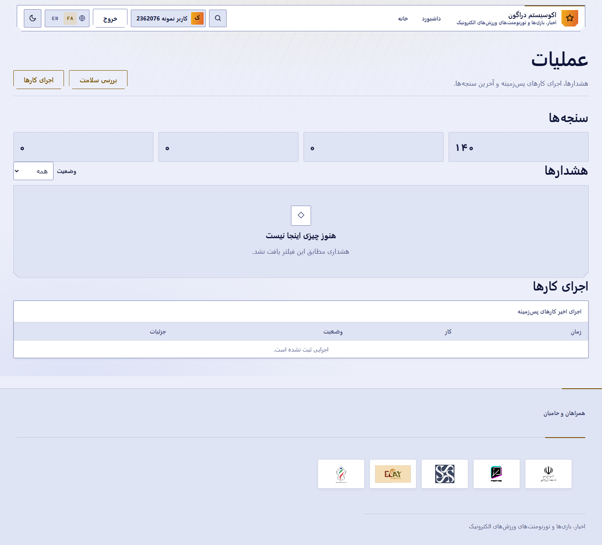

شکل — داشبورد عملیات، هشدارها و سنجه‌ها.

**مجوز:** `support.manage`.

## ۱۹.۵ تعدیل

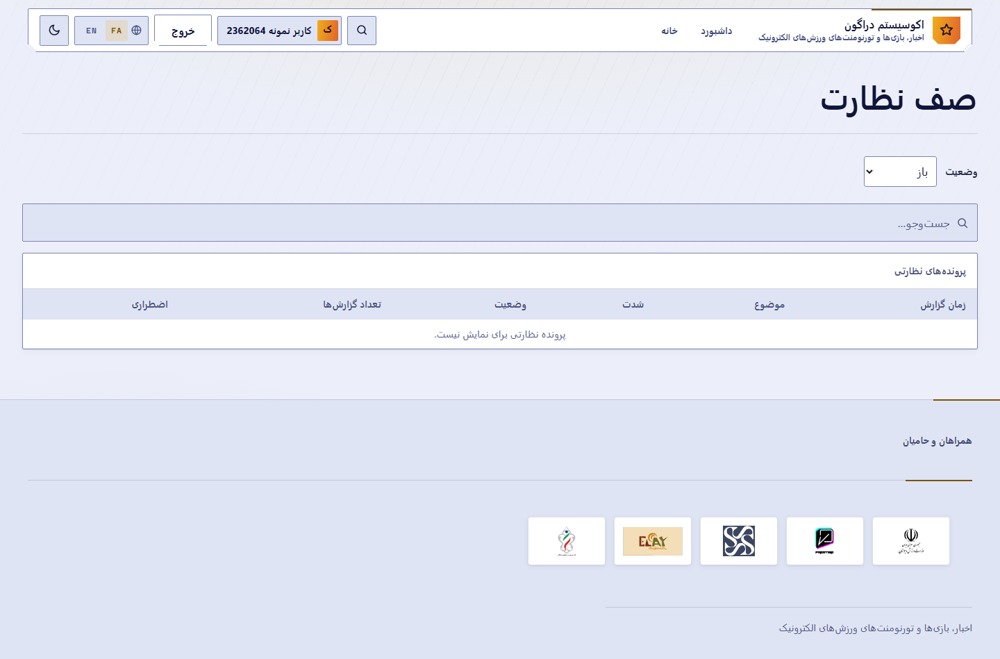

شکل — صف تعدیل محتوا.

**مجوز:** `moderation.manage`.

---

# فصل ۲۰ — اعلان‌ها و رویدادهای دامنه

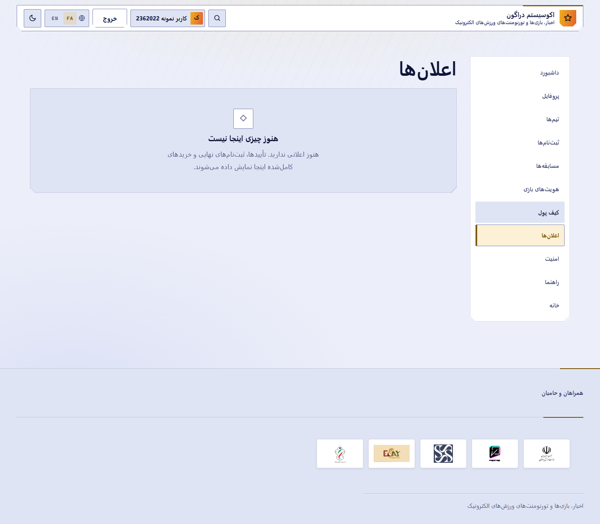

شکل — صندوق اعلان‌های درون‌برنامه‌ای.

## ۲۰.۱ کانال‌ها

| کانال | وضعیت |
|---|---|
| درون‌برنامه‌ای | همیشه فعال |
| پیامک اطلاع‌رسانی | **بسته** — `NOTIFICATIONS_SMS_ENABLED` (OD-008) |
| ایمیل | **بسته** — `NOTIFICATIONS_EMAIL_ENABLED` (OD-003)؛ آداپتور واقعی هم وجود ندارد |
| اعلان فوری | **بسته** — `PUSH_NOTIFICATIONS_ENABLED` (OD-027)؛ آداپتور وجود ندارد |

رمز یک‌بارمصرف ورود از این دروازه‌ها مستقل است و همیشه کار می‌کند.

## ۲۰.۲ کنسول اعلان‌ها **اپراتور**

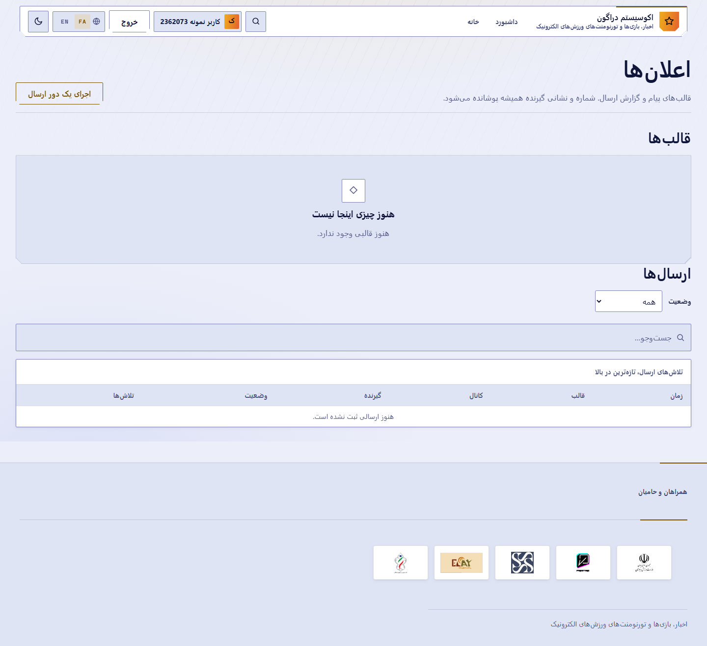

شکل — قالب‌ها و ارسال اعلان‌ها. **مجوز:** `support.manage`.

## ۲۰.۳ رویدادهای دامنه

رویدادها از طریق «صندوق خروجی تراکنشی» منتشر می‌شوند: رویداد با همان تراکنشی نوشته می‌شود که
تغییر داده را ثبت می‌کند، بنابراین اگر تراکنش لغو شود هیچ رویدادی منتشر نمی‌شود. فهرست کامل
در `DOMAIN_EVENTS.md`.

---

# فصل ۲۱ — تنظیم سرویس‌های ثالث **فنی**

خلاصه در این فصل؛ جزئیات کامل در `THIRD_PARTY_SETUP_FA.md`.

| دسته | وضعیت |
|---|---|
| MongoDB | یکپارچه‌سازی واقعی |
| Kavenegar (پیامک) | یکپارچه‌سازی واقعی |
| GitHub Actions | یکپارچه‌سازی واقعی |
| پرداخت | فقط شبیه‌سازی |
| ایمیل | فقط شبیه‌سازی |
| پخش زنده | فقط شبیه‌سازی؛ آروان رد می‌شود |
| ذخیره‌سازی شیء / CDN | آداپتور وجود ندارد |
| Push | آداپتور وجود ندارد |
| تحلیل خارجی | مسیر ارسال وجود ندارد |

## ۲۱.۱ رسانه

بارگذاری بر پایه امضای محتوا اعتبارسنجی می‌شود، نه پسوند فایل. سقف حجم با `MEDIA_MAX_BYTES`
تعیین می‌شود.

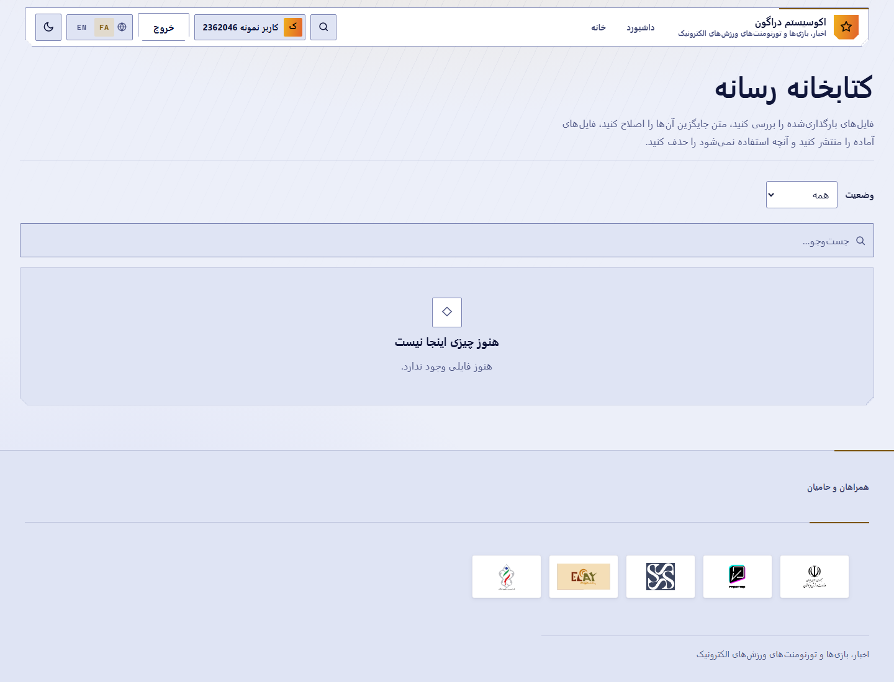

شکل — کتابخانه رسانه. **مجوز:** `content.publish`.

---

# فصل ۲۲ — استقرار، سلامت، پشتیبان‌گیری و CI **فنی**

## ۲۲.۱ سلامت سرویس

| مسیر | معنی |
|---|---|
| `/health` | زنده بودن فرایند |
| `/health/ready` | آمادگی، شامل بررسی اتصال پایگاه داده |

`/health` ممکن است در حالی ۲۰۰ بدهد که پایگاه داده در دسترس نیست؛ برای آمادگی از
`/health/ready` استفاده کنید.

## ۲۲.۲ فرمان‌های تأیید

```bash
npm run ci:validate
npm run typecheck
npm run lint
npm test
npm run test:integration
npm run build
npm run test:budget
npm run closure:check
npm run decision:check
npm run verify:migrations
npm run verify:persistence
```

## ۲۲.۳ CI

ده کار در `.github/workflows/ci.yml`. بدون هیچ secret، با `permissions: contents: read`.
جزئیات در `CI.md`.

> محافظت شاخه هنوز فعال نشده است؛ این اقدام مدیر مخزن است.

## ۲۲.۴ پشتیبان‌گیری

> **هیچ تمرین بازیابی از پشتیبان انجام نشده است.** پیش از تولید لازم است.

---

# فصل ۲۳ — رفع خطاهای رایج

| نشانه | علت محتمل | راه‌حل |
|---|---|---|
| کارت مدیریتی دیده نمی‌شود | نداشتن مجوز | فصل ۴؛ درخواست نقش از اپراتور فنی |
| «دسترسی مجاز نیست» | نداشتن مجوز | همان |
| صفحه باز می‌شود ولی خالی است | نبود داده، نه نبود مجوز | حالت «خالی» با «عدم دسترسی» فرق دارد |
| دوره منتشر نمی‌شود | چرخه یا پیش‌نیاز | فصل ۱۰٫۲ و ۱۰٫۴ |
| «دوره پولی» غیرفعال | OD-015 | فصل ۱۰٫۵ |
| پخش واقعی دیده نمی‌شود | ارائه‌دهنده `stub` | فصل ۱۲٫۱ |
| آرشیو پخش کار نمی‌کند | OD-014 | فصل ۱۲٫۲ |
| سرور با `arvan` بالا نمی‌آید | رد عمدی (OD-013) | مقدار را `stub` بگذارید |
| تسویه سبد فیزیکی رد می‌شود | OD-019 | فصل ۱۵٫۲ |
| مسدودکردن کاربر پیدا نمی‌شود | OD-017 — اصلاً وجود ندارد | فصل ۱۴٫۲ |
| اعتراض به تعدیل ممکن نیست | OD-024 | فصل ۱۴٫۲ |
| ایمیل نمی‌رسد | آداپتور ایمیل وجود ندارد (OD-003) | فصل ۲۰٫۱ |
| کد ورود نمی‌رسد | محدودیت نرخ یا محیط توسعه | فصل ۲٫۳ |
| ثبت‌نام تورنمنت پولی نیست | OD-007 | فصل ۸٫۱ |
| برداشت نقدی پیدا نمی‌شود | وجود ندارد | فصل ۱۶٫۲ |
| ورودی تاریخ اشتباه محاسبه می‌شود | زمان‌ها UTC ذخیره می‌شوند | فصل ۹٫۲ |
| نقش داده شد ولی کارت نیامد | پروب مجوز کش شده | خروج و ورود دوباره |

---

# فصل ۲۴ — محدودیت‌های فعلی و تصمیم‌های باز

## ۲۴.۱ تصمیم‌های بازی که کاربر آن‌ها را حس می‌کند

| تصمیم باز | متغیر محیطی | وضعیت پیش‌فرض |
|---|---|---|
| OD-014 | `STREAM_RIGHTS_POLICY_APPROVED` | بسته (fail-closed) |
| OD-007 | `PAID_TOURNAMENTS_ENABLED` | بسته (fail-closed) |
| OD-015 | `PAID_COURSES_ENABLED` | بسته (fail-closed) |
| OD-017 | `SOCIAL_BLOCKING_ENABLED` | بسته (fail-closed) |
| OD-024 | `MODERATION_APPEALS_ENABLED` | بسته (fail-closed) |
| OD-027 | `PUSH_NOTIFICATIONS_ENABLED` | بسته (fail-closed) |
| OD-019 | `PHYSICAL_FULFILLMENT_ENABLED` | بسته (fail-closed) |
| OD-020 | `ENTITLEMENT_REVOCATION_ENABLED` | بسته (fail-closed) |
| OD-008 | `NOTIFICATIONS_SMS_ENABLED` | بسته (fail-closed) |
| OD-026 | `ANALYTICS_EXTERNAL_ENABLED` | بسته (fail-closed) |

## ۲۴.۲ نقص‌های تأییدشده

جزئیات کامل در `TRAINING_AND_UX_FINDINGS.md`.

| شناسه | موضوع | طبقه‌بندی |
|---|---|---|
| F-01 | نبود رابط تخصیص نقش | نقص محصول و تجربه کاربری |
| F-02 | ناآشکار بودن چرخه `draft ← review ← published` | مسئله آموزشی |
| F-03 | کشف پیش‌نیازهای انتشار فقط با شکست | پیش‌نیاز و کشف‌پذیری |
| F-04 | پخش زنده روی شبیه‌ساز | ارائه‌دهنده خارجی و تصمیم باز |
| F-05 | کشف‌پذیری محدود ناحیه‌های مدیریتی | کشف‌پذیری |
| F-06 | `TRUSTED_PROXIES` در `.env.example` نیست | نقص مستندسازی |
| F-07 | ناهمخوانی محیط آزمون با پیش‌فرض‌ها | نقص مستندسازی |

## ۲۴.۳ وضعیت انتشار

تصمیم انتشار اکوسیستم: **NO-GO**. این راهنما آن را تغییر نمی‌دهد.

---

# فصل ۲۵ — ضمیمه مسیرها، مجوزها و متغیرهای محیطی

## ۲۵.۱ مسیرهای رابط کاربری

| مسیر | نما | پوسته |
|---|---|---|
| `/:locale(fa\|en)` | `HomeView.vue` | public |
| `/:locale(fa\|en)/design-system` | `DesignSystemView.vue` | public |
| `/:locale(fa\|en)/content` | `ContentListView.vue` | public |
| `/:locale(fa\|en)/content/:type/:slug` | `ContentDetailView.vue` | public |
| `/:locale(fa\|en)/games` | `GamesCatalogView.vue` | public |
| `/:locale(fa\|en)/games/:slug` | `GameDetailView.vue` | public |
| `/:locale(fa\|en)/tournaments` | `TournamentsListView.vue` | public |
| `/:locale(fa\|en)/tournaments-calendar` | `TournamentCalendarView.vue` | public |
| `/:locale(fa\|en)/tournaments/:slug` | `TournamentDetailView.vue` | public |
| `/:locale(fa\|en)/teams` | `TeamsDirectoryView.vue` | public |
| `/:locale(fa\|en)/teams/:slug` | `PublicTeamView.vue` | public |
| `/:locale(fa\|en)/players` | `PlayersDirectoryView.vue` | public |
| `/:locale(fa\|en)/streams` | `StreamsListView.vue` | public |
| `/:locale(fa\|en)/streams/:slug` | `StreamDetailView.vue` | public |
| `/:locale(fa\|en)/academy` | `AcademyCatalogView.vue` | public |
| `/:locale(fa\|en)/academy/courses/:slug` | `CourseDetailView.vue` | public |
| `/:locale(fa\|en)/academy/learn/:enrollmentId` | `CoursePlayerView.vue` | account |
| `/:locale(fa\|en)/store` | `StoreCatalogView.vue` | public |
| `/:locale(fa\|en)/store/products/:slug` | `StoreProductView.vue` | public |
| `/:locale(fa\|en)/cart` | `CartView.vue` | account |
| `/:locale(fa\|en)/checkout` | `CheckoutView.vue` | account |
| `/:locale(fa\|en)/account/orders` | `AccountOrdersView.vue` | account |
| `/:locale(fa\|en)/account/registrations` | `AccountRegistrationsView.vue` | account |
| `/:locale(fa\|en)/account/matches` | `AccountMatchesView.vue` | account |
| `/:locale(fa\|en)/community` | `CommunityFeedView.vue` | public |
| `/:locale(fa\|en)/community/posts/:id` | `CommunityPostView.vue` | public |
| `/:locale(fa\|en)/search` | `SearchView.vue` | public |
| `/:locale(fa\|en)/help` | `HelpView.vue` | public |
| `/:locale(fa\|en)/players/:username` | `PublicPlayerView.vue` | public |
| `/:locale(fa\|en)/auth/mobile` | `AuthMobileView.vue` | public |
| `/:locale(fa\|en)/account` | `AccountOverviewView.vue` | account |
| `/:locale(fa\|en)/account/profile` | `AccountProfileView.vue` | account |
| `/:locale(fa\|en)/account/security` | `AccountSecurityView.vue` | account |
| `/:locale(fa\|en)/account/wallet` | `AccountWalletView.vue` | account |
| `/:locale(fa\|en)/account/notifications` | `NotificationsInboxView.vue` | account |
| `/:locale(fa\|en)/account/teams` | `TeamsView.vue` | account |
| `/:locale(fa\|en)/account/teams/:id` | `TeamDetailView.vue` | account |
| `/:locale(fa\|en)/account/gaming-identities` | `GamingIdentitiesView.vue` | account |
| `/:locale(fa\|en)/admin` | `AdminOverviewView.vue` | admin |
| `/:locale(fa\|en)/admin/users` | `AdminUsersView.vue` | admin |
| `/:locale(fa\|en)/admin/audit` | `AdminAuditView.vue` | admin |
| `/:locale(fa\|en)/admin/moderation` | `AdminModerationView.vue` | admin |
| `/:locale(fa\|en)/admin/courses` | `AdminCoursesView.vue` | admin |
| `/:locale(fa\|en)/admin/chat` | `AdminChatView.vue` | admin |
| `/:locale(fa\|en)/admin/streams` | `AdminStreamsView.vue` | admin |
| `/:locale(fa\|en)/admin/prizes` | `AdminPrizesView.vue` | admin |
| `/:locale(fa\|en)/admin/store` | `AdminStoreView.vue` | admin |
| `/:locale(fa\|en)/admin/orders` | `AdminOrdersView.vue` | admin |
| `/:locale(fa\|en)/admin/community` | `AdminCommunityView.vue` | admin |
| `/:locale(fa\|en)/admin/media` | `AdminMediaView.vue` | admin |
| `/:locale(fa\|en)/admin/configuration` | `AdminConfigurationView.vue` | admin |
| `/:locale(fa\|en)/admin/notifications` | `AdminNotificationsView.vue` | admin |
| `/:locale(fa\|en)/admin/organizer` | `OrganizerWorkspaceView.vue` | admin |
| `/:locale(fa\|en)/admin/finance` | `AdminFinanceView.vue` | admin |
| `/:locale(fa\|en)/admin/support` | `AdminSupportView.vue` | admin |
| `/:locale(fa\|en)/admin/operations` | `AdminOperationsView.vue` | admin |
| `/:locale(fa\|en)/admin/content` | `AdminContentView.vue` | admin |
| `/:locale(fa\|en)/admin/games` | `AdminGamesView.vue` | admin |
| `/:locale(fa\|en)/admin/tournaments` | `AdminTournamentsView.vue` | admin |
| `/:locale(fa\|en)/admin/tournaments/:id/registrations` | `AdminTournamentRegistrationsView.vue` | admin |
| `/:locale(fa\|en)/admin/tournaments/:id/competition` | `AdminTournamentCompetitionView.vue` | admin |
| `/:locale(fa\|en)/403` | `ForbiddenView.vue` | public |
| `/:pathMatch(.*)*` | `NotFoundView.vue` | public |

## ۲۵.۲ مجوز ← نقش‌های دارنده

| مجوز | نقش‌های دارنده |
|---|---|
| `admin.access` | `super_administrator`، `platform_administrator`، `finance_operator`، `financial_approver`، `content_author`، `content_editor`، `content_publisher`، `streaming_operator`، `tournament_administrator`، `tournament_organizer`، `education_manager`، `live_chat_moderator`، `community_moderator`، `shop_operator`، `support_operator`، `security_auditor` |
| `users.read` | `super_administrator`، `platform_administrator`، `support_operator` |
| `users.suspend` | `super_administrator`، `platform_administrator` |
| `roles.read` | `super_administrator`، `platform_administrator` |
| `roles.assign` | `super_administrator`، `platform_administrator` |
| `config.read` | `super_administrator`، `platform_administrator` |
| `config.propose` | `super_administrator`، `platform_administrator`، `finance_operator` |
| `config.approve` | `super_administrator`، `financial_approver` |
| `audit.read` | `super_administrator`، `platform_administrator`، `finance_operator`، `financial_approver`، `security_auditor` |
| `audit.export` | `super_administrator`، `security_auditor` |
| `content.write` | `super_administrator`، `content_author`، `content_editor`، `content_publisher` |
| `content.publish` | `super_administrator`، `content_publisher` |
| `games.manage` | `super_administrator`، `content_publisher` |
| `stream.manage` | `super_administrator`، `streaming_operator` |
| `chat.moderate` | `super_administrator`، `live_chat_moderator`، `community_moderator` |
| `education.manage` | `super_administrator`، `education_manager` |
| `store.manage` | `super_administrator`، `shop_operator` |
| `tournament.manage` | `super_administrator`، `tournament_administrator`، `tournament_organizer` |
| `finance.manage` | `super_administrator`، `finance_operator` |
| `finance.approve` | `super_administrator`، `financial_approver` |
| `moderation.manage` | `super_administrator`، `community_moderator` |
| `support.manage` | `super_administrator`، `support_operator` |

## ۲۵.۳ متغیرهای محیطی

| متغیر | نوع | Feature Gate |
|---|---|---|
| `ANALYTICS_EXTERNAL_ENABLED` | غیرمحرمانه | OD-026 |
| `ANALYTICS_PSEUDONYM_SALT` | غیرمحرمانه | — |
| `AUTH_SECRET` | محرمانه | — |
| `ENABLE_DEV_ROUTES` | غیرمحرمانه | — |
| `ENTITLEMENT_REVOCATION_ENABLED` | غیرمحرمانه | OD-020 |
| `HOST` | غیرمحرمانه | — |
| `KAVENEGAR_API_KEY` | محرمانه | — |
| `KAVENEGAR_OTP_TEMPLATE` | غیرمحرمانه | — |
| `KAVENEGAR_SENDER` | غیرمحرمانه | — |
| `MEDIA_MAX_BYTES` | غیرمحرمانه | — |
| `MODERATION_APPEALS_ENABLED` | غیرمحرمانه | OD-024 |
| `MONGODB_URI` | محرمانه | — |
| `NODE_ENV` | غیرمحرمانه | — |
| `NOTIFICATIONS_EMAIL_ENABLED` | غیرمحرمانه | — |
| `NOTIFICATIONS_SMS_ENABLED` | غیرمحرمانه | OD-008 |
| `OTP_MAX_ATTEMPTS` | غیرمحرمانه | — |
| `OTP_REQUESTS_PER_IP` | غیرمحرمانه | — |
| `OTP_REQUESTS_PER_MOBILE` | غیرمحرمانه | — |
| `OTP_RESEND_SECONDS` | غیرمحرمانه | — |
| `OTP_TTL_SECONDS` | غیرمحرمانه | — |
| `OTP_WINDOW_SECONDS` | غیرمحرمانه | — |
| `PAID_COURSES_ENABLED` | غیرمحرمانه | OD-015 |
| `PAID_TOURNAMENTS_ENABLED` | غیرمحرمانه | OD-007 |
| `PAYMENTS_CALLBACK_SECRET` | محرمانه | — |
| `PAYMENTS_MOCK_ENABLED` | غیرمحرمانه | — |
| `PAYMENTS_PURCHASE_TTL_SECONDS` | غیرمحرمانه | — |
| `PHYSICAL_FULFILLMENT_ENABLED` | غیرمحرمانه | OD-019 |
| `PORT` | غیرمحرمانه | — |
| `PUBLIC_ORIGIN` | غیرمحرمانه | — |
| `PUSH_NOTIFICATIONS_ENABLED` | غیرمحرمانه | OD-027 |
| `RECENT_AUTH_MINUTES` | غیرمحرمانه | — |
| `SESSION_TTL_HOURS` | غیرمحرمانه | — |
| `SMS_PROVIDER` | غیرمحرمانه | — |
| `SOCIAL_BLOCKING_ENABLED` | غیرمحرمانه | OD-017 |
| `STREAMING_PROVIDER` | غیرمحرمانه | — |
| `STREAM_PLAYBACK_TTL_SECONDS` | غیرمحرمانه | — |
| `STREAM_RIGHTS_POLICY_APPROVED` | غیرمحرمانه | OD-014 |
| `STREAM_SECURE_LINK_SECRET` | محرمانه | — |
| `TRUSTED_PROXIES` | غیرمحرمانه | — |

## ۲۵.۴ اسناد مرتبط

| سند | موضوع |
|---|---|
| `DRAGON_CAPABILITY_MATRIX.md` | فهرست کامل قابلیت‌ها و مسیرها |
| `THIRD_PARTY_SETUP_FA.md` | پیکربندی سرویس‌های ثالث و رویه موقت نقش |
| `TRAINING_AND_UX_FINDINGS.md` | یافته‌های آموزشی و نقص‌ها |
| `SCREENSHOT_INVENTORY.md` | فهرست تصویرها |
| `ENVIRONMENT_REFERENCE_FA.md` | ضمیمه متغیرهای محیطی |
| `GUIDE_VERIFICATION_MAP.json` | نگاشت گام‌های راهنما به آزمون خودکار |
