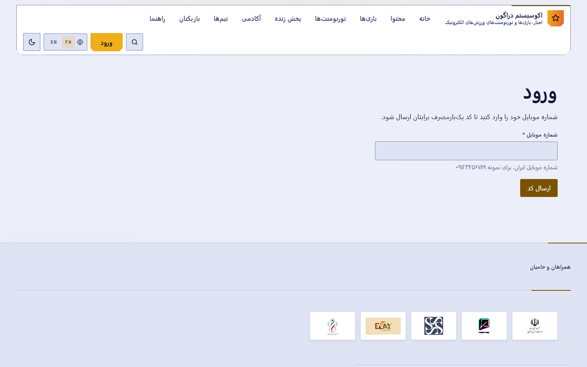
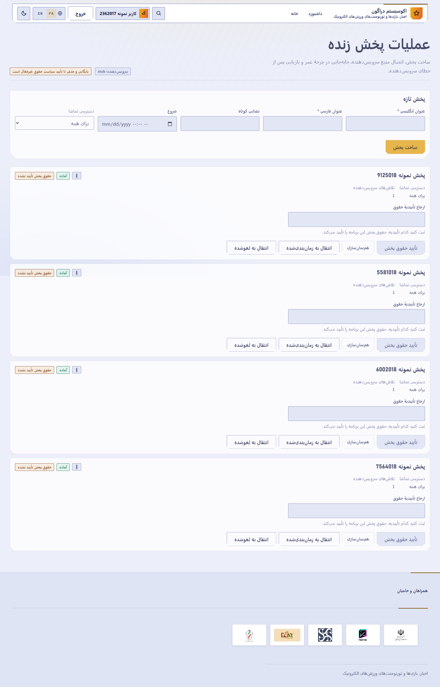

# راهنمای شروع سریع اکوسیستم Dragon

## مرجع عملیاتی کوتاه برای اپراتورها و مدیران

> این راهنما بر اساس قابلیت‌های واقعی نسخه ثبت‌شده تهیه شده است.
> قابلیت‌های وابسته به تصمیم‌های باز، مجوزهای خاص یا ارائه‌دهندگان خارجی
> به‌صورت محدود، غیرفعال، آزمایشی یا مسدود مشخص شده‌اند.

هر بخش به فصل متناظر در **راهنمای جامع** (`dragon-complete-guide-fa`) ارجاع می‌دهد.

---

## ۱. اجرای محلی — فصل ۲

```bash
npm install
npm run docker:up
npm run migrate
npm run build
```

برای ساخت فایل محیط محلی، `06-CREATE-LOCAL-ENV.cmd` را اجرا کنید. **هیچ مقدار محرمانه واقعی
را در مخزن قرار ندهید.**

---

## ۲. ورود — فصل ۲



شکل — ورود با شماره موبایل و رمز یک‌بارمصرف.

۱. `/{locale}/auth/mobile`
۲. شماره موبایل → «دریافت کد»
۳. کد → تأیید
۴. تکمیل پروفایل در نخستین ورود

---

## ۳. تشخیص نقش فعلی — فصل ۴

۱. به `/{locale}/account` بروید.
۲. کارت‌های بخش مدیریت را ببینید: هر کارت یعنی مجوز متناظرش را دارید.
۳. اگر هیچ کارتی نیست، حساب شما هیچ مجوز مدیریتی ندارد.

**نکته کلیدی:** نبود کارت تقریباً همیشه یعنی نبود مجوز، نه خرابی.

---

## ۴. دریافت نقش مجاز — فصل ۴٫۵

**در نسخه فعلی هیچ رابط کاربری برای تخصیص نقش وجود ندارد.**

- **کاربر و مدیر غیرفنی:** از اپراتور فنی مجاز درخواست کنید. API را دستی فراخوانی نکنید.
- **اپراتور فنی:** رویه «راهکار موقت برای اپراتور فنی» در `THIRD_PARTY_SETUP_FA.md`.

نقش را بر پایه کمترین دسترسی لازم انتخاب کنید:

| هدف عملیاتی | نقش | مجوز |
|---|---|---|
| ساخت و انتشار دوره | `education_manager` | `education.manage` |
| عملیات پخش زنده | `streaming_operator` | `stream.manage` |
| تعدیل گفت‌وگوی زنده | `live_chat_moderator` | `chat.moderate` |
| مدیریت تورنمنت | `tournament_administrator` | `tournament.manage` |
| فروشگاه و سفارش | `shop_operator` | `store.manage` |
| پشتیبانی و عملیات | `support_operator` | `support.manage` |
| مالی (آغازکننده) | `finance_operator` | `finance.manage` |
| مالی (تأییدکننده) | `financial_approver` | `finance.approve` |

---

## ۵. ساخت تورنمنت — فصل ۸

**نقش:** `tournament_administrator` یا `tournament_organizer` · **مجوز:** `tournament.manage`
**پیش‌نیاز:** یک بازی منتشرشده

۱. `/{locale}/admin/tournaments`
۲. تورنمنت جدید: بازی، عنوان و خلاصه دوزبانه، ظرفیت، حالت تأیید، بازه ثبت‌نام و برگزاری
۳. قوانین دوزبانه
۴. انتقال به وضعیت منتشرشده

> ورودی پولی **بسته** است — `PAID_TOURNAMENTS_ENABLED` (OD-007).

---

## ۶. ساخت دوره — فصل ۱۰

**نقش:** `education_manager` · **مجوز:** `education.manage`

```text
گزینه دوره‌ها دیده نمی‌شود
→ بررسی نقش و education.manage
→ در صورت نبود مجوز، ارجاع به اپراتور فنی
→ پس از تخصیص نقش، بررسی مسیر /{locale}/admin/courses
→ ساخت draft
→ انتقال draft به review
→ تکمیل coach، خلاصه فارسی و انگلیسی، حداقل یک درس و یک درس الزامی
→ انتشار از review
```

> **چرخه واقعی `draft ← review ← published` است.** انتقال مستقیم `draft` به `published`
> پذیرفته نمی‌شود.

**پیش‌نیازهای انتشار:** خلاصه فارسی، خلاصه انگلیسی، مربی **تأییدشده**، حداقل یک درس، حداقل
یک درس الزامی.

> دوره پولی **بسته** است — `PAID_COURSES_ENABLED` (OD-015).

---

## ۷. عملیات پخش زنده — فصل ۱۲

**نقش:** `streaming_operator` · **مجوز:** `stream.manage`



شکل — کنسول عملیات پخش زنده.

**حساس** واقعیت این نسخه:

- ساخت، زمان‌بندی و provision رکورد پخش **کار می‌کند**؛
- ارائه‌دهنده `stub` است — یک **شبیه‌سازی قطعی**، نه پخش واقعی؛
- `STREAMING_PROVIDER=arvan` **عمداً رد می‌شود** و راه‌اندازی را متوقف می‌کند؛
- پخش زنده واقعی آروان **پشتیبانی و تأیید نشده است** (OD-013)؛
- آرشیو و حذف محتوا **بسته** است (OD-014).

---

## ۸. تعدیل گفت‌وگو — فصل ۱۳

**نقش:** `live_chat_moderator` · **مجوز:** `chat.moderate` · **مسیر:** `/{locale}/admin/chat`

این نقش **نمی‌تواند حساب را تعلیق کند**. اختیارش محدود به اتاق‌های تخصیص‌یافته است.

---

## ۹. افزودن کالای فروشگاه — فصل ۱۵

**نقش:** `shop_operator` · **مجوز:** `store.manage` · **مسیر:** `/{locale}/admin/store`

این نقش به دفتر کل و پرداخت جایزه دسترسی ندارد.

> کالای فیزیکی قابل تسویه نیست — `PHYSICAL_FULFILLMENT_ENABLED` (OD-019).

---

## ۱۰. کیف پول و انتقال — فصل ۱۶ و ۱۷

- کاربر: `/{locale}/account/wallet`
- اپراتور مالی: `/{locale}/admin/finance` (`finance.manage`)
- تأییدکننده: `finance.approve` — کنترل دوگانه، یک نفر نمی‌تواند هر دو نقش را روی یک اقدام
  پرریسک داشته باشد.

> **برداشت نقدی وجود ندارد.**

---

## ۱۱. عملیات و مدیریت — فصل ۱۹

| مسیر | مجوز |
|---|---|
| `/{locale}/admin` | `admin.access` |
| `/{locale}/admin/users` | `users.read` |
| `/{locale}/admin/audit` | `audit.read` |
| `/{locale}/admin/operations` | `support.manage` |
| `/{locale}/admin/configuration` | `config.read` |

---

## ۱۲. بیست خطای پرتکرار — فصل ۲۳

| # | نشانه | علت | راه‌حل |
|---|---|---|---|
| ۱ | کارت مدیریتی نیست | نبود مجوز | درخواست نقش از اپراتور فنی |
| ۲ | «دسترسی مجاز نیست» | نبود مجوز | همان |
| ۳ | نقش داده شد ولی کارت نیامد | کش پروب مجوز | خروج و ورود دوباره |
| ۴ | `draft` منتشر نمی‌شود | چرخه | ابتدا `review` |
| ۵ | انتشار دوره رد می‌شود | پیش‌نیاز ناقص | مربی تأییدشده، خلاصه دوزبانه، درس الزامی |
| ۶ | «دوره پولی» غیرفعال | OD-015 | دوره رایگان |
| ۷ | پخش واقعی دیده نمی‌شود | ارائه‌دهنده `stub` | OD-013 |
| ۸ | آرشیو پخش کار نمی‌کند | OD-014 | — |
| ۹ | سرور با `arvan` بالا نمی‌آید | رد عمدی | `STREAMING_PROVIDER=stub` |
| ۱۰ | ثبت‌نام پولی تورنمنت نیست | OD-007 | تورنمنت رایگان |
| ۱۱ | تسویه سبد فیزیکی رد می‌شود | OD-019 | کالای دیجیتال |
| ۱۲ | مسدودکردن کاربر نیست | OD-017 | وجود ندارد |
| ۱۳ | اعتراض به تعدیل نیست | OD-024 | وجود ندارد |
| ۱۴ | ایمیل نمی‌رسد | آداپتور ندارد (OD-003) | — |
| ۱۵ | اعلان فوری نمی‌رسد | OD-027 | — |
| ۱۶ | کد ورود نمی‌رسد | محدودیت نرخ | صبر تا پایان پنجره |
| ۱۷ | برداشت نقدی نیست | وجود ندارد | — |
| ۱۸ | ساعت مسابقه اشتباه است | ذخیره UTC، نمایش محلی | منطقه زمانی دستگاه |
| ۱۹ | بازی در فهرست تورنمنت نیست | منتشر نشده | ابتدا بازی را منتشر کنید |
| ۲۰ | صفحه خالی است | نبود داده | «خالی» با «عدم دسترسی» فرق دارد |

---

## ۱۳. چک‌لیست ارائه‌دهنده و Feature Gate — فصل ۲۱ و ۲۴

| تصمیم باز | متغیر محیطی | وضعیت پیش‌فرض |
|---|---|---|
| OD-014 | `STREAM_RIGHTS_POLICY_APPROVED` | بسته (fail-closed) |
| OD-007 | `PAID_TOURNAMENTS_ENABLED` | بسته (fail-closed) |
| OD-015 | `PAID_COURSES_ENABLED` | بسته (fail-closed) |
| OD-017 | `SOCIAL_BLOCKING_ENABLED` | بسته (fail-closed) |
| OD-024 | `MODERATION_APPEALS_ENABLED` | بسته (fail-closed) |
| OD-027 | `PUSH_NOTIFICATIONS_ENABLED` | بسته (fail-closed) |
| OD-019 | `PHYSICAL_FULFILLMENT_ENABLED` | بسته (fail-closed) |
| OD-020 | `ENTITLEMENT_REVOCATION_ENABLED` | بسته (fail-closed) |
| OD-008 | `NOTIFICATIONS_SMS_ENABLED` | بسته (fail-closed) |
| OD-026 | `ANALYTICS_EXTERNAL_ENABLED` | بسته (fail-closed) |

| ارائه‌دهنده | وضعیت |
|---|---|
| MongoDB | یکپارچه‌سازی واقعی |
| Kavenegar | یکپارچه‌سازی واقعی |
| GitHub Actions | یکپارچه‌سازی واقعی |
| پرداخت | شبیه‌سازی |
| ایمیل | شبیه‌سازی |
| پخش زنده | شبیه‌سازی؛ آروان رد می‌شود |
| ذخیره‌سازی شیء / CDN | آداپتور ندارد |
| Push | آداپتور ندارد |
| تحلیل خارجی | مسیر ارسال ندارد |
